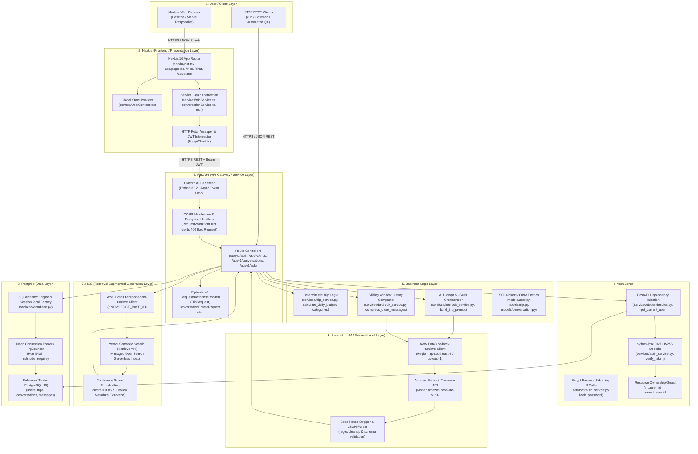
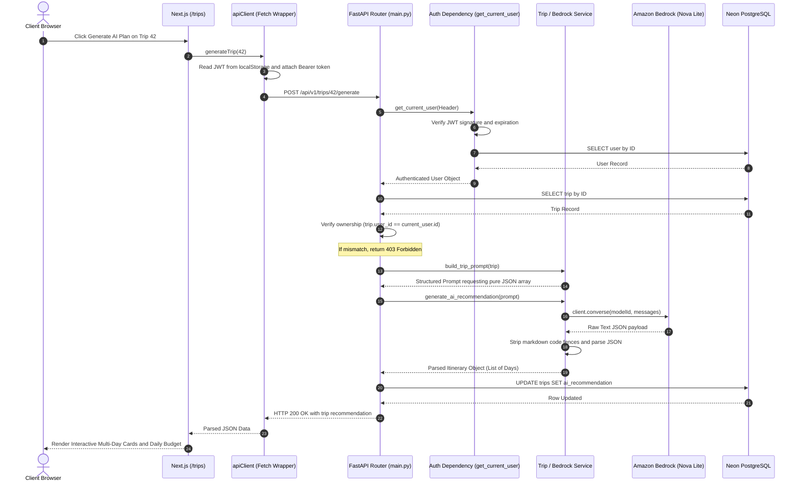
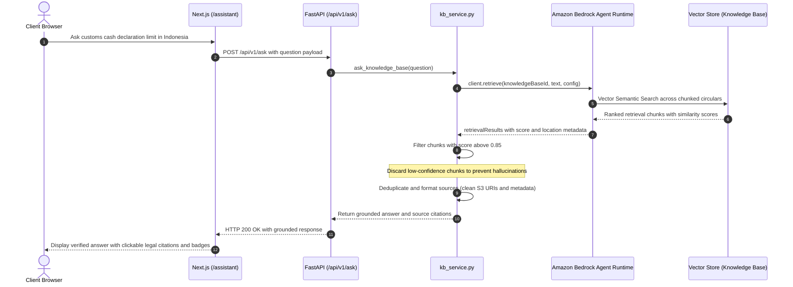

# KelanaAI System Architecture Document

> **Target Audience:** Systems Architects, Software Engineers, DevOps/SREs, and Technical Stakeholders.  
> **Core Objective:** Provide a rigorous, defensible, end-to-end architectural blueprint of KelanaAI. An engineer reading this document should be able to accurately redraw the entire system topology from memory, explain every design decision, and trace data flow across all system boundaries.

---

## 1. High-Level Architecture Topology

KelanaAI is architected as an 8-tier, cloud-native, decoupled system designed to separate stateless presentation, asynchronous API orchestration, deterministic domain logic, serverless transactional persistence, and enterprise generative AI / vector retrieval pipelines.



---

## 2. End-to-End System Sequence Flows

### 2.1. AI Trip Itinerary Generation Sequence
The following sequence details how a trip recommendation is generated, validated, sent to Amazon Bedrock, parsed, persisted, and returned to the client:



### 2.2. Grounded RAG Regulatory Assistant Sequence
The sequence below illustrates how regulatory queries are answered using strict vector similarity search and source citations:



---

## 3. Layer-by-Layer Architectural Walkthrough

---

### Layer 1: User / Client Layer

#### What It Does
The User / Client Layer represents the external perimeter where human users and automated clients interface with KelanaAI.
- **Entry Points:**
  - Modern Evergreen Browsers (Chrome, Firefox, Safari, Edge) running across Desktop, Tablet, and Mobile viewports.
  - Automated testing agents, health check probes, and developer tools (`curl`, Postman, Playwright scripts).
- **User Journey:**
  1. **Discovery & Onboarding:** An unauthenticated visitor hits the landing page (`/`), views hero value propositions, sample itineraries, and navigates to `/login` or `/register`.
  2. **Session Acquisition:** Successful registration or credential submission yields a signed JWT, persisted in client storage.
  3. **Trip Planning Lifecycle:** The user navigates to `/trips`, creates a trip with budget/duration parameters, modifies itineraries (`/trips/[id]/edit`), triggers generative AI planning (`/trips/[id]/generate`), and tracks daily budget categories.
  4. **Multi-Session Chat:** The user accesses `/chat` to engage in multi-turn conversational trip advisory, organizing discussions across distinct, renameable conversation threads.
  5. **Regulatory Verification:** The user accesses `/assistant` to submit high-stakes questions (customs declarations, visa rules, medication import restrictions) grounded in statutory circulars.
  6. **Account & Profile Auditing:** The user visits `/profile` to view identity details and trip count telemetry.

#### Why It Exists
- **Separation of Concerns:** The client device is solely responsible for input capture, presentation formatting, and user gesture orchestration. It maintains zero knowledge of database credentials, AWS IAM keys, or downstream service topologies.
- **Tradeoffs Made:**
  - *Client-Side Session Storage:* Storing the access token in `localStorage` was chosen for rapid implementation and seamless single-page application (SPA) client-side token attachment across decoupled origins (`kelana-ai-five.vercel.app` -> `kelana-ai-cc9cb4d7.fastapicloud.dev`).
  - *Tradeoff:* Vulnerability to cross-site scripting (XSS) if third-party scripts execute. Mitigated by strict Content Security Policies, zero dynamic HTML injection (`dangerouslySetInnerHTML` is avoided), and using `react-markdown` with default sanitization.
- **Alternative Approaches Rejected:**
  - *Server-Side Rendered (SSR) Cookies on a Unified Domain:* Rejected because frontend and backend are hosted on separate platforms (Vercel vs. FastApiCloud / PaaS) without a shared apex domain, which would introduce complex third-party cookie blocking and cross-site tracking restrictions in modern browsers.

#### Data Flow & Interfaces
- **Inputs:** Human gestures (mouse clicks, keyboard input, route navigation) and browser storage reads.
- **Transformations:** Form states are captured via controlled React components, validated for non-empty fields, and serialized into JSON payloads.
- **Exits:** Dispatched via standard HTTPS REST calls to the Next.js presentation layer (or directly to FastAPI via API client abstraction) carrying the `Authorization: Bearer <token>` header.

---

### Layer 2: Next.js (Frontend / Presentation Layer)

#### What It Does
The Next.js layer provides the interactive graphical user interface, server-side document rendering, static asset distribution, and client-side HTTP communication orchestration.
- **Key Files & Modules:**
  - `frontend/app/layout.tsx`: Root HTML layout, Geist font optimization, and global `UserProvider` injection.
  - `frontend/app/page.tsx`: Landing page with dynamic hero section, trip generation preview, and feature grid.
  - `frontend/app/login/page.tsx` & `frontend/app/register/page.tsx`: Authentication interfaces with input validation.
  - `frontend/app/trips/page.tsx` & `frontend/app/trips/[id]/edit/page.tsx`: Trip CRUD interfaces, modal workflows, and AI generation triggers.
  - `frontend/app/chat/page.tsx`: Full-featured multi-session conversational interface with thread management, message streaming emulation, and markdown rendering.
  - `frontend/app/assistant/page.tsx`: Grounded Q&A interface displaying verified answers and source document citations.
  - `frontend/context/UserContext.tsx`: React Context managing global authenticated user state (`user`, `setUser`, `refreshUser`).
  - `frontend/lib/apiClient.ts`: `authenticatedFetch` utility intercepting outbound requests to attach JWT tokens and redirecting on 401.
  - `frontend/services/*`: Domain-specific API service abstraction (`authService.ts`, `tripService.ts`, `conversationService.ts`, `assistantService.ts`).

#### Why It Exists
- **SSR/SSG & Client Component Strategy:**
  - Root layouts and static metadata (`metadata` export in `app/layout.tsx`) utilize Server Rendering for Search Engine Optimization (SEO) and low First Contentful Paint (FCP).
  - Highly interactive application views utilize `"use client"` directives to bind React 19 state machines, lifecycle hooks (`useEffect`, `useCallback`, `useRef`), and local storage access.
- **Decoupled API Client Abstraction:**
  - The `authenticatedFetch` wrapper in `lib/apiClient.ts` isolates HTTP plumbing from UI components. It centralizes token retrieval, headers merging, and global error handling (e.g., auto-expiring sessions redirecting to `/login` on HTTP 401).
- **Tradeoffs Made:**
  - *Tailwind CSS v4 & PostCSS:* Chosen for zero-runtime CSS overhead, highly maintainable design tokens, and rapid UI development over heavy component libraries (e.g., Material UI or Chakra UI).
  - *Lightweight Markdown Parsing:* Selected `react-markdown` for rendering assistant responses, avoiding heavy rich-text editor dependencies.
- **Alternative Approaches Rejected:**
  - *Single Page App (SPA) via Vite/CRA:* Rejected due to lack of built-in server-side metadata generation, slower initial route loading, and absence of standardized full-stack build conventions.

#### Data Flow & Interfaces
- **Inputs:** User actions, route changes via `next/navigation`, and incoming JSON responses from the backend.
- **Transformations:** Maps UI form fields to typed TypeScript payloads (`CreateTripPayload`, `LoginPayload`, `MessageCreateRequest`), strips raw S3 bucket prefixes from source citations (`cleanDocumentPath` in `assistantService.ts`), and maps ISO date strings to human-readable formats (`formatConversationDate`).
- **Exits:** Standard HTTPS requests directed to the FastAPI Gateway (`NEXT_PUBLIC_API_URL`).

---

### Layer 3: FastAPI (API Gateway / Service Layer)

#### What It Does
The FastAPI layer serves as the unified API gateway, HTTP ingress controller, request validator, and asynchronous execution engine.
- **Key Files & Modules:**
  - `backend/main.py`: ASGI application definition, CORS middleware configuration, exception handlers, and direct route declarations (`/health`, `/api/v1/trips`, `/api/v1/ask`).
  - `backend/routers/auth.py`: Sub-router mounted at `/api/v1/auth` handling user registration, authentication, and profile queries (`/register`, `/login`, `/me`).
  - `backend/routers/conversations.py`: Sub-router mounted at `/api/v1/conversations` handling conversation thread creation, retrieval, updates, and multi-turn message handling.
- **Key Responsibilities:**
  - **Asynchronous Execution & Concurrency:** Powered by Uvicorn and Starlette's ASGI event loop, efficiently handling concurrent client I/O without thread lockup.
  - **Request & Response Validation (Pydantic v2):** Strict schema enforcement using Pydantic models (`TripRequest`, `ConversationCreateRequest`, `MessageCreateRequest`, `EmailStr`).
  - **Custom Exception Handling:** Centralized `validation_exception_handler` intercepts `RequestValidationError` to return structured HTTP 400 Bad Request responses containing clear JSON field errors rather than unhandled 500 crashes.
  - **CORS Middleware:** Enforces origin filtering via `CORSMiddleware`, reading `FRONTEND_URL` from the environment to allow credentials while rejecting unauthorized cross-origin requests.

#### Why It Exists
- **High Throughput & Native Async:** Python's FastAPI provides near-Go/Node speed benchmarks due to Starlette while retaining Python's rich ecosystem for AI/ML (boto3, SQLAlchemy).
- **Auto-Generated OpenAPI/Swagger:** Automatically publishes interactive documentation at `/docs` and schema specifications at `/openapi.json`, accelerating frontend-backend contract integration.
- **Tradeoffs Made:**
  - *Synchronous Database Drivers with Async Framework:* SQLAlchemy 2.0 is run with standard synchronous sessions (`psycopg2-binary`) inside endpoint handlers. FastAPI automatically runs standard synchronous `def` endpoints in an external worker threadpool, preventing blocking of the main event loop while avoiding the complexity of async DB connection drivers.
- **Alternative Approaches Rejected:**
  - *Django / Flask:* Django was rejected as overly monolithic and opinionated for an AI microservice architecture; Flask was rejected due to lack of native Pydantic integration, asynchronous route handling, and automatic OpenAPI schema generation.

#### Data Flow & Interfaces
- **Inputs:** Incoming HTTP requests over TCP port 8000, query parameters, route path variables, and JSON payloads.
- **Transformations:** Pydantic models parse raw JSON bytes into typed Python objects, validating data constraints. URL path parameters (e.g., `trip_id: int`) are typecast and validated.
- **Exits:** Validated data structures are passed downstream to the Auth Layer dependencies and Business Logic service modules. Returns JSON responses formatted according to response models (`AuthResponse`, `TripRecommendationResponse`, etc.).

---

### Layer 4: Auth Layer

#### What It Does
The Auth Layer enforces identity verification, credential security, token lifecycle management, and fine-grained resource-level authorization.
- **Key Files & Modules:**
  - `backend/services/auth_service.py`: Core cryptographic hashing, JWT encoding, and token validation functions.
  - `backend/services/dependencies.py`: Dependency injection providers (`get_current_user`, `get_db`).
  - `backend/models/user.py`: Relational database model representing user credentials and account attributes.
- **Technical Capabilities:**
  - **Cryptographic Password Hashing:** Utilizes `bcrypt` with automatic salt generation (`bcrypt.gensalt()`) to prevent rainbow table attacks. Plaintext passwords are never persisted or logged.
  - **Stateless JWT Issuance:** Uses `python-jose` to sign JSON Web Tokens using HMAC-SHA256 (`HS256`). Tokens carry user identity (`sub`), issuance, and expiration timestamps (`exp = 24 hours`).
  - **Dependency Injection Guard (`get_current_user`):** Extracts the `Authorization` header, enforces the `Bearer <token>` format, verifies the cryptographic signature against `SECRET_KEY`, queries the database for the active user record, and injects the `User` ORM instance into endpoint functions.
  - **Resource-Level Authorization (Ownership Enforcement):**
    - `Trip` endpoints verify `trip.user_id == current_user.id`, returning HTTP 403 Forbidden on mismatch.
    - `Conversation` endpoints query records filtered by `Conversation.user_id == current_user.id`, ensuring complete multi-tenant user isolation.
    - `/api/v1/auth/me` resolves identity exclusively from token payload, eliminating parameter-tampering risks.

#### Why It Exists
- **Stateless Horizontal Scalability:** JWT-based authentication eliminates the need for shared server-side session stores (e.g., Redis cluster), allowing multiple FastAPI backend instances to validate requests independently.
- **Zero-Trust Boundary:** No mutative operation or sensitive data read can execute without passing through the `get_current_user` dependency.
- **Tradeoffs Made:**
  - *Symmetric Signing (`HS256`) vs. Asymmetric (`RS256`):* `HS256` was selected because the FastAPI service is both the token issuer and consumer. This simplifies key management without the overhead of public/private key pairs.
  - *24-Hour Expiration without Refresh Token Rotation:* Chosen to keep local development and initial deployments simple without requiring background refresh token persistence tables.
- **Alternative Approaches Rejected:**
  - *Stateful Server-Side Sessions (Redis/DB):* Rejected because it introduces an additional point of failure and increases latency by requiring an external session lookup for every HTTP request.
  - *Third-Party Auth Providers (Auth0, Clerk, Firebase):* Rejected to keep KelanaAI completely self-contained, cloud-agnostic, and devoid of external per-user licensing costs.

#### Data Flow & Interfaces
- **Inputs:** Raw HTTP `Authorization` header containing `Bearer <jwt-token>` and user credentials (`email`, `password`) on registration/login.
- **Transformations:** Hashed passwords via `bcrypt.hashpw()`; decoded JWT claims yielding integer `user_id` (`sub`); validated `User` database entity.
- **Exits:** Injects authenticated `current_user: User` into protected route handlers; returns `{"access_token": token, "token_type": "bearer"}` to clients.

---

### Layer 5: Business Logic Layer

#### What It Does
The Business Logic Layer encapsulates the core domain rules, computational formulas, travel heuristics, and prompt orchestration workflows of KelanaAI, completely decoupled from web presentation frameworks and low-level database drivers.
- **Key Files & Modules:**
  - `backend/services/trip_service.py`: Pure domain logic containing budget calculations, tier categorization, cost validations, and travel season heuristics.
  - `backend/services/bedrock_service.py`: Orchestration logic for constructing generative AI prompts, conversation history compression, and Bedrock output parsing.
  - `backend/models/*`: SQLAlchemy domain entity definitions (`User`, `Trip`, `Conversation`, `Message`).
- **Core Domain Logic:**
  - **Budget Math & Categorization:**
    $$\text{Daily Budget} = \frac{\text{Total Budget}}{\text{Days}}$$
    Categorizes travelers into explicit financial tiers:
    - *Backpacker:* $\text{Budget} < \$1,000$ (Bus transit, hostel suggestions)
    - *Standard:* $\$1,000 \le \text{Budget} \le \$3,000$ (Train transit, boutique hotels)
    - *Luxury:* $\text{Budget} > \$3,000$ (Flight transit, premium resorts)
  - **Conversation History Sliding Window Compaction:**
    - For conversation threads exceeding 500 messages (`threshold=500`), older exchanges are automatically condensed using `summarize_message_history()`.
    - Preserves the most recent 100 messages (`keep_recent=100`) in full fidelity while prepending an executive summary of earlier context, preventing context length overflow and excessive token billing.
  - **Role Normalization & Merge Rules:**
    - Maps database message roles to Bedrock-compliant roles (`user` or `assistant`).
    - Consolidates sequential messages with identical roles into a single message block (mandatory for Bedrock Converse API validation).
    - Guarantees the conversation starts with a `user` turn.

#### Why It Exists
- **Clean Architecture & Decoupling:** Isolating calculations (`trip_service.py`) and prompt preparation (`bedrock_service.py`) from FastAPI route handlers allows domain logic to be unit tested in milliseconds without mocking HTTP requests or database connections.
- **Maintainability:** Modifying budget thresholds, adding new travel categories, or refining prompt templates requires changing only service files, leaving route controllers and database models untouched.
- **Tradeoffs Made:**
  - *Heuristic Summarization vs. Recursive LLM Summarization:* Older messages are summarized using text extraction and truncation heuristics rather than making a recursive LLM call. This prioritizes speed, eliminates extra LLM cost, and avoids latency spikes during active chat.
- **Alternative Approaches Rejected:**
  - *Embedding Business Logic Directly Inside Route Handlers:* Rejected because it violates the Single Responsibility Principle, creates duplicate logic between trip creation and updates, and hampers test automation.

#### Data Flow & Interfaces
- **Inputs:** Validated domain data from route controllers (e.g., `destination`, `days`, `budget`, database message lists).
- **Transformations:** Mathematical division, category classification, prompt string interpolation, list filtering, and JSON string serialization.
- **Exits:** Returns structured dictionaries, formatted prompt strings, or parsed Python lists to route controllers and AI service clients.

---

### Layer 6: Bedrock (LLM / Generative AI Layer)

#### What It Does
The Bedrock Layer manages generative artificial intelligence execution, interacting directly with AWS foundation models to produce personalized travel itineraries and conversational chat replies.
- **Key Files & Modules:**
  - `backend/services/bedrock_service.py`: Houses `boto3` client initialization, `client.converse()` invocations, code fence stripping, and JSON validation.
- **Technical Configuration:**
  - **Service & SDK:** AWS SDK for Python (`boto3`, `botocore`).
  - **Target Model:** `amazon.nova-lite-v1:0` (Amazon Bedrock Nova Lite) deployed in active AWS regions (e.g., `ap-southeast-2` or `us-east-1`).
  - **API Invocation:** Bedrock Converse API (`client.converse()`), providing unified multi-turn conversation formatting and system instruction handling.
- **Payload Handling & Guardrails:**
  - **Structured JSON Enforcement:** Prompts instruct the model to output **strictly** valid JSON arrays with no surrounding commentary or markdown code fences.
  - **Output Sanitization:** In case the foundation model includes code blocks, a regex sanitizer strips markdown prefixes and suffixes:
    ```python
    cleaned = re.sub(r"^```(?:json)?\s*", "", raw_text.strip(), flags=re.IGNORECASE)
    cleaned = re.sub(r"\s*```$", "", cleaned.strip())
    ```
  - **Resilience & Fault Tolerance:**
    - Catches network timeouts (`ConnectTimeoutError`, `ReadTimeoutError`, `EndpointConnectionError`) and translates them to HTTP 502 Bad Gateway.
    - Inspects `ClientError` for `ThrottlingException` or `ServiceUnavailable` and maps to HTTP 502 with actionable retry semantics.

#### Why It Exists
- **Enterprise-Grade Managed Foundation Models:** Amazon Bedrock provides fully managed serverless access to cutting-edge models without requiring self-hosted GPU infrastructure, vLLM setups, or Kubernetes cluster maintenance.
- **Data Privacy & Compliance:** Bedrock guarantees that customer prompt data and generated outputs are not used to train base AWS models and remain encrypted in transit and at rest.
- **Tradeoffs Made:**
  - *Nova Lite Model Selection:* Chosen over heavier models (e.g., Claude 3.5 Sonnet or Nova Pro) to achieve optimal price-performance balance, sub-second latency for interactive chat, and sufficient reasoning capabilities for structured JSON generation.
- **Alternative Approaches Rejected:**
  - *Direct OpenAI / Anthropic APIs:* Rejected in favor of AWS Bedrock to maintain unified AWS IAM role governance, single-cloud enterprise billing, and seamless private VPC connectivity.

#### Data Flow & Interfaces
- **Inputs:** Structured message histories `[{"role": "user"|"assistant", "content": [{"text": "..."}]}]` or customized prompt strings.
- **Transformations:** AWS SigV4 signed HTTP POST requests dispatched to the AWS Bedrock regional runtime endpoint; raw model responses parsed into native Python dictionaries/lists.
- **Exits:** Returns parsed JSON itineraries (list of day objects) or raw conversational text replies to route controllers for database persistence.

---

### Layer 7: RAG (Retrieval-Augmented Generation Layer)

#### What It Does
The RAG Layer delivers grounded, hallucination-free answers to legal, visa, customs, and travel advisory inquiries by retrieving verified domain documents from an indexed vector knowledge base.
- **Key Files & Modules:**
  - `backend/services/kb_service.py`: Contains `ask_knowledge_base()` and `get_bedrock_agent_runtime_client()`.
  - `docs/questions.md` & `docs/test_result.md`: Evaluation suite and benchmarking reports verifying RAG accuracy versus raw base LLM parametric memory.
- **Technical Architecture & Workflow:**
  - **Runtime Client:** Initialized via `boto3.client("bedrock-agent-runtime", region_name=AWS_REGION)`.
  - **Knowledge Base Storage:** Amazon Bedrock Knowledge Bases backed by managed OpenSearch Serverless vector indices, housing chunked regulatory circulars, customs regulations, and embassy notices.
  - **Vector Semantic Search:** Executes `client.retrieve()` with `retrievalQuery={"text": query}` and `vectorSearchConfiguration={"numberOfResults": 1}`.
  - **Strict Similarity Score Thresholding:**
    ```python
    for result in results:
        score = result.get("score") or 0
        if score <= 0.85:
            continue
    ```
    Every chunk must satisfy a cosine similarity score $> 0.85$. Passages below this threshold are discarded, ensuring that low-confidence or loosely matching text is never presented as statutory fact.
  - **Source Provenance & Citation Extraction:**
    Captures `document_id`, S3 location, metadata (`x-amz-bedrock-kb-source-uri`), and confidence scores, deduplicating references to ensure full auditability.

#### Why It Exists
- **Elimination of Critical Hallucinations:** As proven in `docs/test_result.md`, base LLMs frequently hallucinate legal thresholds (e.g., misclassifying currency declaration thresholds as taxable events). Grounded RAG retrieval prevents legal and financial liability for travelers.
- **Traceability & Trust:** Enables users to audit advice by providing exact document references and official regulation numbers (e.g., Bank Indonesia Regulation PBI No. 19/7/PBI/2017).
- **Tradeoffs Made:**
  - *Direct Retrieve API vs. RetrieveAndGenerate:* The codebase specifically utilizes the Bedrock `retrieve` API rather than `retrieveAndGenerate`. This allows the application to directly inspect similarity scores, enforce the $> 0.85$ quality gate, and format citation payloads before generating responses.
- **Alternative Approaches Rejected:**
  - *In-Database pgvector Search:* Rejected to avoid consuming CPU/RAM on the transactional PostgreSQL instance with vector similarity calculations and high-dimensional embedding storage.

#### Data Flow & Interfaces
- **Inputs:** User question string submitted via `POST /api/v1/ask`.
- **Transformations:** Vector embeddings calculated on the fly by Bedrock; semantic k-NN search executed across OpenSearch index; candidate chunks filtered by score $> 0.85$; S3 URIs normalized into human-readable document titles.
- **Exits:** Returns dictionary containing combined grounded answer text and deduplicated source citation objects:
  ```json
  {
    "answer": "Under Bank Indonesia Regulation...",
    "source": [
      {
        "document_id": "customs_currency_regulations.pdf",
        "location": { "s3Location": { "uri": "s3://..." } },
        "score": 0.892
      }
    ]
  }
  ```

---

### Layer 8: Postgres (Data Layer)

#### What It Does
The Postgres Data Layer provides ACID-compliant persistence for application entities, relational integrity, foreign key cascades, and transactional consistency.
- **Key Files & Modules:**
  - `backend/database.py`: SQLAlchemy database engine initialization, connection pooling setup, declarative base definition, and table bootstrap (`init_db()`).
  - `backend/migrate.py`: Standalone migration runner synchronizing ORM models and inspecting database tables.
  - `backend/models/user.py`: `User` entity mapping.
  - `backend/models/trip.py`: `Trip` entity mapping.
  - `backend/models/conversation.py`: `Conversation` and `Message` entity mappings.
- **Relational Schema Design:**

```
┌──────────────────────────────────────────────────────────────────────────┐
│                                 USERS                                    │
├───────────────────┬───────────────────────────────┬──────────────────────┤
│ id (PK)           │ Integer                       │ Auto-increment       │
│ name              │ String                        │ NOT NULL             │
│ email             │ String                        │ NOT NULL, UNIQUE     │
│ password_hash     │ String                        │ NOT NULL             │
└───────────────────┴──────────────┬────────────────┴──────────────────────┘
                                   │ 1:N
         ┌─────────────────────────┴─────────────────────────┐
         ▼ 1:N (cascade delete)                              ▼ 1:N
┌─────────────────────────────────────────┐ ┌──────────────────────────────────────────┐
│             CONVERSATIONS               │ │                 TRIPS                  │
├─────────────────┬───────────────────────┤ ├───────────────────┬──────────────────────┤
│ id (PK)         │ BigInteger (Auto-inc) │ │ id (PK)           │ Integer (Auto-inc)   │
│ user_id (FK)    │ BigInteger, INDEX     │ │ user_id (FK)      │ Integer (Nullable)   │
│ title           │ String(100), Nullable │ │ destination       │ String, NOT NULL     │
│ created_at      │ Timestamptz, NOW()    │ │ days              │ Integer, NOT NULL    │
└─────────────────┬───────────────────────┘ │ budget            │ Float, NOT NULL      │
                  │                         │ category          │ String, NOT NULL     │
                  │ 1:N (cascade delete)    │ daily_budget      │ Float, NOT NULL      │
                  ▼                         │ ai_recommendation │ Text (JSON), NULL    │
┌─────────────────────────────────────────┐ │ created_at        │ Timestamptz, NOW()   │
│                MESSAGES                 │ └───────────────────┴──────────────────────┘
├─────────────────┬───────────────────────┤
│ id (PK)         │ BigInteger (Auto-inc) │
│ conversation_id │ BigInteger, INDEX     │
│ role            │ String(16), NOT NULL  │
│ content         │ Text, NOT NULL        │
│ created_at      │ Timestamptz, NOW()    │
└─────────────────┴───────────────────────┘
```

- **Connection Pooling & Production Scalability:**
  - Configured for **Neon Serverless PostgreSQL** using pooled connection endpoints (`ep-xyz-pooler.<region>.neon.tech`).
  - Pooled endpoints utilize **PgBouncer** on port 5432 with transaction pooling, allowing hundreds of concurrent serverless requests without exhausting PostgreSQL connection limits.
  - Enforces SSL communication (`sslmode=require`).

#### Why It Exists
- **Relational Integrity & ACID Compliance:** Guarantees that deleting a user cleanly cascades to delete their associated conversations and messages (`ondelete="CASCADE"`), preventing orphaned records.
- **Serverless Autoscaling with Scale-to-Zero:** Neon's storage-compute separation scales compute resources down to zero during idle periods and scales up in under 500ms on inbound traffic, dramatically reducing hosting expenses.
- **Tradeoffs Made:**
  - *Relational Postgres over Document NoSQL (MongoDB):* Relational schemas enforce strict type safety and relational guarantees across users and trips. Itinerary JSON is stored in an `ai_recommendation` text column, providing the flexibility of document storage where needed without sacrificing relational integrity.
  - *Decoupled Vector Store vs. pgvector:* Rather than installing `pgvector` inside the primary database, vector storage is delegated to Amazon Bedrock Knowledge Bases. This isolates vector compute from the transactional database.
- **Alternative Approaches Rejected:**
  - *SQLite:* Unsuitable for multi-user production deployments due to file-level write locking and lack of multi-process concurrency.
  - *DynamoDB:* Rejected due to complex foreign-key querying patterns, eventual consistency challenges, and vendor lock-in.

#### Data Flow & Interfaces
- **Inputs:** Synchronous ORM queries dispatched via SQLAlchemy `SessionLocal` instances (`db.add()`, `db.query()`, `db.commit()`, `db.delete()`).
- **Transformations:** Python ORM entity attributes translated into SQL statements (`SELECT`, `INSERT`, `UPDATE`, `DELETE`) by SQLAlchemy and sent via `psycopg2-binary` protocol over TLS.
- **Exits:** Tabular rows mapped back to Python ORM instances and serialized to JSON responses via Pydantic.

---

## 4. Deep-Dive Technology Justifications & Trade-Off Analyses

Every architectural layer in KelanaAI was selected based on explicit engineering criteria: performance, security boundaries, operational simplicity, and domain-specific alignment. Below is the detailed technical defense, trade-off analysis, and alternative evaluation for each critical technology choice in the stack.

---

### 4.1. Next.js 16 App Router (Frontend / Presentation Layer)

- **Stack Mapping:** `Layer 2: Frontend / Presentation Layer`
- **Key Technical Aspects:** React 19 ecosystem, hybrid Server/Client component rendering, automated SEO metadata compilation, optimized font/asset pipeline, and seamless Vercel edge deployment.

#### Primary Technical Rationale
KelanaAI requires both public discovery (high SEO ranking for travel destination searches) and rich, low-latency client-side reactivity (interactive multi-day trip planners, multi-turn AI chat interfaces, modal forms). 

Next.js 16 with the App Router satisfies this duality through a hybrid architecture:
1. **Server-Rendered Foundation & SEO:** Static metadata (`metadata` object in `app/layout.tsx`) and foundational HTML documents are rendered server-side, yielding near-instant First Contentful Paint (FCP) and optimal search engine crawlability without client-side JavaScript execution overhead.
2. **Granular Client Component Boundaries:** Highly dynamic features (e.g., `app/chat/page.tsx`, `app/trips/page.tsx`, `app/assistant/page.tsx`) explicitly declare `"use client"`. This confines React 19 reconciliation, hook lifecycles (`useState`, `useCallback`, `useRef`), and browser-only APIs (`localStorage`, window redirects) to client subtrees without sacrificing server-rendered layout speed.
3. **Ecosystem & Developer Velocity:** Direct access to modern React primitives, Lucide icons, and `react-markdown` accelerates frontend feature delivery while maintaining strict TypeScript type safety across frontend service contracts.

#### Key Trade-offs & Limitations
- **Hydration Boundary Traps:** Mixing server and client components introduces potential hydration mismatches if server-rendered HTML diverges from client state (e.g., rendering timestamps or reading `localStorage` during initial server render). This requires careful hydration guarding (`typeof window !== "undefined"` checks in `apiClient.ts`).
- **Build-Time Variable Inlining:** In Next.js, `NEXT_PUBLIC_*` environment variables are baked into client JavaScript bundles at build time. Updating the backend API endpoint (`NEXT_PUBLIC_API_URL`) requires a full project rebuild and redeployment rather than a runtime config change.

#### Alternatives Considered
- **Vite + React (Pure Single Page Application - SPA):**  
  *Why Rejected:* A pure SPA serves an empty `<div id="root"></div>` shell on first load, degrading search engine indexing (SEO) and increasing initial Time to Interactive (TTI) on mobile cellular connections due to heavy client-side bundle downloading before first render.
- **SvelteKit / Nuxt.js:**  
  *Why Rejected:* While SvelteKit and Nuxt offer elegant reactivity, the React 19 ecosystem possesses substantially more robust tooling for AI streaming, markdown rendering, and enterprise component design systems.

---

### 4.2. FastAPI (API Gateway / Service Layer)

- **Stack Mapping:** `Layer 3: API Gateway / Service Layer`
- **Key Technical Aspects:** Python 3.12+ ASGI runtime on Uvicorn, native asynchronous event loop, Pydantic v2 data validation at C-speed, automatic OpenAPI/Swagger generation, and direct access to the Python AI/ML ecosystem.

#### Primary Technical Rationale
As an AI-native travel platform, KelanaAI’s backend core interfaces heavily with foundation model SDKs (`boto3`), vector retrieval pipelines, and database ORM sessions.

FastAPI was selected for three decisive architectural reasons:
1. **Native Async Concurrency & ASGI Throughput:** Built upon Starlette and Uvicorn, FastAPI provides non-blocking network I/O capable of handling hundreds of concurrent incoming requests with minimal memory footprint, matching Node.js/Go speed benchmarks while remaining in Python.
2. **Pydantic v2 Schema Enforcement:** Request bodies (`TripRequest`, `ConversationCreateRequest`, `QuestionRequest`) and responses are validated against strongly typed Pydantic models compiled in Rust (`pydantic-core`), providing sub-millisecond validation and rejecting malformed payloads before they touch business logic.
3. **Native Python AI/ML Synergy:** Using Python for the API layer eliminates inter-process serialization overhead. The same runtime executing the HTTP router directly executes AWS Bedrock Converse API SDK calls, prompt compaction algorithms, and future ML expansions.

#### Key Trade-offs & Limitations
- **Sync/Async Execution Discipline:** Synchronous database operations (`psycopg2-binary` via SQLAlchemy) inside route handlers run inside FastAPI's external worker threadpool. Developers must remain disciplined: declaring a blocking database query inside an `async def` function will freeze the event loop.
- **Dynamic Typing Quirks:** Despite Pydantic and type hints, Python remains dynamically typed at runtime, requiring thorough unit tests and static type checking (`mypy`/`ruff`) to prevent runtime type errors.

#### Alternatives Considered
- **Django REST Framework (DRF):**  
  *Why Rejected:* Django is an opinionated, monolithic framework with substantial cold-start overhead in serverless and container PaaS environments. Its ORM and request-response lifecycle are inherently synchronous and heavier than needed for a decoupled AI microservice.
- **Node.js / Express.js or NestJS:**  
  *Why Rejected:* While Node.js offers high async I/O performance, JavaScript/TypeScript backends create an awkward divide when interfacing with enterprise AI pipelines, vector data processing, and Python-centric data science libraries.

---

### 4.3. PostgreSQL (Data Layer)

- **Stack Mapping:** `Layer 8: Postgres / Data Layer`
- **Key Technical Aspects:** ACID compliance, relational foreign key constraints with cascade deletes, flexible semi-structured JSON storage, connection pooling via PgBouncer, and scale-to-zero serverless hosting (Neon).

#### Primary Technical Rationale
KelanaAI manages structured relational domains (users, trips, multi-turn conversation threads, message histories) alongside semi-structured generative outputs (dynamic multi-day AI itineraries).

PostgreSQL delivers the optimal persistence foundation:
1. **Relational Integrity & Cascade Safety:** Multi-tenant user isolation relies on rigid foreign key constraints. When a user deletes their account, PostgreSQL automatically cascades deletions across `conversations`, `messages`, and `trips` (`ondelete="CASCADE"`), preventing orphaned records and ensuring data privacy compliance.
2. **Hybrid Relational & Semi-Structured Data:** The `ai_recommendation` column in the `trips` table stores serialized JSON arrays representing multi-day itineraries. This gives KelanaAI the flexibility of document storage for complex day-by-day schemas while retaining relational table guarantees for IDs, budgets, and user relationships.
3. **Serverless Cloud Scale (Neon):** Neon decouples compute from storage, allowing the database to scale to zero during idle periods and autoscale compute within 500ms on inbound traffic. Connection pooling via **PgBouncer** on port 5432 prevents connection starvation from concurrent stateless backend requests.

#### Key Trade-offs & Limitations
- **Schema Migration Overhead:** Unlike schemaless document stores, relational schema updates require formal migration scripts (`backend/migrate.py` or Alembic) to alter tables safely in production.
- **Connection Limit Sensitivity:** Direct PostgreSQL connections are resource-intensive (each connection spawns a backend process). Application backends must route queries through a connection pooler (PgBouncer) to prevent database crashes under traffic bursts.

#### Alternatives Considered
- **MongoDB / Document NoSQL:**  
  *Why Rejected:* MongoDB lacks rigid relational integrity constraints across multi-tenant relationships. Enforcing cascading deletes and relational user ownership checks in application code increases software complexity and risks data corruption.
- **SQLite:**  
  *Why Rejected:* SQLite uses file-level locking, making it incapable of handling concurrent multi-user write operations in containerized cloud environments.

---

### 4.4. Amazon Bedrock (LLM / Generative AI Layer)

- **Stack Mapping:** `Layer 6: Bedrock (LLM / Generative AI Layer)`
- **Key Technical Aspects:** Managed serverless foundation models (`amazon.nova-lite-v1:0`), enterprise data privacy guarantees, unified Converse API, AWS SigV4 IAM authentication, and zero GPU infrastructure management.

#### Primary Technical Rationale
Generative travel itineraries and multi-turn conversational chat require high-reasoning foundation models capable of following strict JSON output constraints with low latency.

Amazon Bedrock provides critical technical advantages:
1. **Enterprise Data Privacy & Security:** Unlike public consumer LLM APIs, Amazon Bedrock guarantees that customer prompts and completions are **never** used to train base AWS models, are not logged by third parties, and remain encrypted in transit (TLS 1.3) and at rest within the designated AWS region (`ap-southeast-2`).
2. **Unified Converse API:** Bedrock's Converse API standardizes multi-turn dialogue structures, role validation (`user`/`assistant`), and system prompts across multiple model providers through a single SDK interface (`boto3`).
3. **AWS IAM Governance:** Authentication utilizes AWS Signature Version 4 (SigV4) IAM credentials or IAM instance roles rather than static, long-lived API keys, eliminating key leakage vulnerabilities and enabling fine-grained AWS CloudTrail auditing.
4. **Nova Lite Price-Performance:** Amazon Nova Lite provides an optimal balance: sub-2-second generation latency, cost-effective token billing, and high prompt compliance for structured JSON itineraries.

#### Key Trade-offs & Limitations
- **Cloud Provider Coupling:** Utilizing Bedrock ties the generative AI pipeline to the AWS cloud ecosystem, requiring AWS credentials and IAM permissions.
- **Regional Availability:** Specific foundation models and Bedrock Agent features may not be available simultaneously across all AWS regions, requiring regional targeting (e.g., `ap-southeast-2` or `us-east-1`).

#### Alternatives Considered
- **Direct OpenAI API (GPT-4o / GPT-4o-mini):**  
  *Why Rejected:* Direct commercial APIs rely on static shared API keys rather than IAM role governance, introduce cross-cloud billing complexity, and raise compliance concerns regarding data sovereignty and third-party data processing.
- **Self-Hosted Open Source Models (vLLM / Ollama on GPU EC2):**  
  *Why Rejected:* Provisioning dedicated GPU instances (e.g., AWS `g5.xlarge`) costs $500+/month minimum regardless of traffic, introduces cold-start latency, and burdens the engineering team with OS patching, CUDA driver updates, and autoscaling management.

---

### 4.5. Amazon Bedrock Knowledge Bases (RAG Layer)

- **Stack Mapping:** `Layer 7: RAG (Retrieval-Augmented Generation Layer)`
- **Key Technical Aspects:** Fully managed RAG pipeline, automated chunking and embedding, OpenSearch Serverless vector index, semantic k-NN search, and strict similarity thresholding (`score > 0.85`).

#### Primary Technical Rationale
Travel consultation often involves high-stakes inquiries—such as currency declaration limits, medication import restrictions, and visa regulations—where base LLM hallucinations can lead to legal penalties or detention for travelers.

Bedrock Knowledge Bases solves this with a turnkey, enterprise RAG pipeline:
1. **Fully Managed Ingestion & Retrieval:** Automatically chunks statutory circulars and travel advisory documents, computes dense vector embeddings using Amazon Titan Text Embeddings, and indexes them in a serverless vector store (OpenSearch Serverless) without requiring manual vector DB maintenance.
2. **Direct Retrieval API & Quality Gating:** By calling `client.retrieve()` directly (rather than `retrieveAndGenerate`), KelanaAI inspects raw cosine similarity scores and enforces a strict quality gate:
   $$\text{Score} > 0.85$$
   Chunks below 0.85 are discarded, guaranteeing that answers are grounded exclusively in high-confidence statutory documentation.
3. **Traceable Citations & Auditability:** Automatically extracts document metadata, S3 URIs, and source IDs, allowing the frontend to present users with verifiable source documents.

#### Key Trade-offs & Limitations
- **Turnkey Chunking Constraints:** Managed knowledge bases utilize standardized chunking algorithms, providing less granular control over custom semantic boundary splitting than hand-rolled chunking scripts.
- **Baseline Serverless Storage Cost:** OpenSearch Serverless imposes a minimum baseline OpenSearch Compute Unit (OCU) cost even when query volumes are low.

#### Alternatives Considered
- **Custom Vector DB Pipeline (LangChain + Pinecone / ChromaDB):**  
  *Why Rejected:* A custom pipeline introduces multiple external vendor dependencies, manual embedding sync scripts, separate billing accounts, and ongoing maintenance of embedding synchronization jobs.
- **In-Database `pgvector` Extension:**  
  *Why Rejected:* Running high-dimensional vector similarity calculations inside the primary PostgreSQL database consumes CPU and memory that should be dedicated to transactional user and trip queries.

---

### 4.6. JWT / JSON Web Tokens (Auth Layer)

- **Stack Mapping:** `Layer 4: Auth Layer`
- **Key Technical Aspects:** Stateless HMAC-SHA256 (`HS256`) signatures, cryptographic claim verification (`sub: user_id`, `exp: timestamp`), zero-database verification latency, and decoupled cross-origin transmission.

#### Primary Technical Rationale
KelanaAI operates as a decoupled architecture where the frontend (Vercel) and backend (FastApiCloud / PaaS) are hosted on distinct cloud infrastructures.

Stateless JWT authentication solves key distributed system challenges:
1. **Stateless Scalability & Zero-DB Overhead:** The JWT contains the user's identity (`sub`) and expiration timestamp signed cryptographically with `SECRET_KEY`. Any backend worker can verify token validity in memory via `python-jose` without querying a central session database or Redis cluster on every incoming request.
2. **Cross-Origin Decoupled Compatibility:** Modern browsers enforce strict privacy restrictions on third-party cookies across differing root domains. Transmitting the JWT via the standard HTTP `Authorization: Bearer <token>` header completely bypasses cookie blocking, ensuring reliable authentication across decoupled deployments.
3. **Zero-Trust Resource Authorization:** Injected dependencies (`get_current_user`) decode the token, load the user ORM entity, and enforce ownership checks (`trip.user_id == current_user.id`) across every mutative endpoint.

#### Key Trade-offs & Limitations
- **Revocation Invalidation Gap:** Stateless JWTs cannot be instantly revoked before their expiration time (24 hours) without introducing a stateful token blocklist.
- **Client Storage Security:** Storing tokens in `localStorage` requires rigorous prevention of Cross-Site Scripting (XSS). KelanaAI mitigates this by avoiding raw HTML rendering, using `react-markdown` with sanitization, and configuring strict Content Security Policies.

#### Alternatives Considered
- **Server-Side Stateful Sessions (Redis / DB Session Table):**  
  *Why Rejected:* Stateful sessions introduce an external database roundtrip for every single HTTP request, creating an infrastructure bottleneck and single point of failure.
- **Third-Party Identity Providers (Auth0 / Clerk / Firebase Auth):**  
  *Why Rejected:* Third-party auth adds external redirect hops, complex SDK dependencies, and recurring per-monthly-active-user (MAU) subscription costs.

---

### 4.7. Infrastructure & Hosting (Vercel + FastAPI Cloud / Neon)

- **Stack Mapping:** `Cross-Cutting Infrastructure & Deployment Architecture`
- **Key Technical Aspects:** Decoupled specialized hosting, global Edge CDN distribution (Vercel), containerized ASGI process management (FastAPI Cloud), serverless database pooling (Neon), and automated Git-driven CI/CD pipelines.

#### Primary Technical Rationale
Modern cloud architectures favor composing specialized best-in-class serverless platforms rather than deploying monolithic virtual machines.

KelanaAI's hosting strategy separates concerns across three optimized tiers:
1. **Frontend on Vercel:** Next.js was built by Vercel. Hosting on Vercel provides native edge caching, instant global CDN routing, automatic SSL certificate provisioning, and zero-configuration preview deployments for every Git pull request.
2. **Backend on FastAPI Cloud / Container PaaS:** Containerized PaaS platforms provide isolated runtime environments, automated health checking against `/health`, environment variable injection, and vertical CPU/RAM scaling tailored to Python async workloads.
3. **Database on Neon Serverless:** Provides automated PostgreSQL storage-compute separation, instant point-in-time restore, and integrated PgBouncer connection pooling, scaling down to zero during inactive hours to minimize operational costs.

#### Key Trade-offs & Limitations
- **Cross-Origin CORS Management:** Decoupled domains require strict `CORSMiddleware` configuration on the backend to prevent cross-origin preflight rejections.
- **Ephemeral PaaS Cold Starts:** Free/hobby container instances may spin down after prolonged inactivity, introducing a 10–15 second cold start on the initial request.

#### Alternatives Considered
- **Full Kubernetes Cluster (AWS EKS / GCP GKE):**  
  *Why Rejected:* Kubernetes introduces enormous operational overhead (Helm charts, ingress controllers, node pool management, cluster monitoring) that is completely disproportionate for a lightweight microservice platform.
- **Single Self-Hosted VPS (Nginx + Docker Compose on DigitalOcean/EC2):**  
  *Why Rejected:* A single VPS represents a single point of failure (SPOF), lacks global edge caching, and requires manual OS security patching, SSL renewals, and backup management. *(Note: KelanaAI retains a fully functional `docker-compose.yml` and Nginx reverse proxy configuration in the repository as an alternative self-hosting option for private/air-gapped deployments).*

---

## 5. Architectural Defensibility & Trade-Off Matrix

The following matrix summarizes the architectural decisions across all 8 layers, articulating the technical defense and rejected alternatives for engineering reviews:

| Layer | Design Decision Selected | Core Technical Justification | Alternative Rejected | Rationale for Rejection |
| :--- | :--- | :--- | :--- | :--- |
| **1. Client** | Browser-native `localStorage` for JWT | Decoupled client-server domains on separate cloud providers (Vercel + FastApiCloud). | Same-site `HttpOnly` cookies | Third-party cookie blocking across separate top-level domains breaks session continuity. |
| **2. Presentation** | Next.js 16 App Router (Hybrid SSR/Client) | Optimized initial SEO metadata paired with high-performance interactive client state. | Pure SPA (Vite / CRA) | Zero SEO metadata capabilities and poorer initial rendering performance. |
| **3. API Gateway** | FastAPI + Pydantic v2 on Uvicorn | Native async I/O, automatic OpenAPI docs, and sub-millisecond payload validation. | Django REST Framework | Heavyweight ORM overhead, slower cold starts, and complex asynchronous configuration. |
| **4. Auth** | Stateless JWT (HS256) + Bcrypt salts | Horizontal scalability with zero database lookup required for cryptographic token verification. | Redis session store | Adds an external infrastructure dependency and network hop for every single request. |
| **5. Business Logic** | Pure Python modules decoupled from web framework | High unit testability, zero framework lock-in, and reusable domain calculation rules. | Logic inside FastAPI route handlers | Violates Single Responsibility, duplicates code, and impairs automated testing. |
| **6. LLM** | AWS Bedrock Converse API (`nova-lite-v1:0`) | Fully managed serverless execution, strict enterprise data privacy, and optimized cost/latency. | Self-hosted Open Source LLM (Ollama/vLLM) | High GPU infrastructure cost, operational maintenance burden, and cold-start latency. |
| **7. RAG** | Bedrock Knowledge Base with `score > 0.85` | Zero hallucinations on statutory travel laws, with verifiable source citation tracking. | Direct Parametric LLM Generation | Unacceptable factual hallucination rate on statutory regulations and currency limits. |
| **8. Data** | Neon Serverless PostgreSQL + PgBouncer | ACID relational integrity, scale-to-zero cost efficiency, and pooled connection resilience. | MongoDB / DynamoDB | Weak relational integrity enforcement for multi-tenant user ownership cascades. |

---

## 6. Security & Boundary Enforcement Architecture

### 6.1. Network Security & Perimeter Defense
- **TLS/HTTPS Everywhere:** All communication between Client, Frontend, Backend, Database, and AWS Bedrock is encrypted in transit using TLS 1.3.
- **CORS Boundary:** The API Gateway rejects any origin not explicitly declared in `FRONTEND_URL`, preventing malicious third-party cross-origin requests.
- **Database Connection Security:** Neon connection strings enforce `sslmode=require`, guaranteeing encrypted transport between FastAPI worker nodes and PostgreSQL compute endpoints.

### 6.2. Multi-Tenant Data Isolation
Every mutative and sensitive query enforces user tenancy at the database level:
- **Trips:** Endpoints check `trip.user_id == current_user.id`. Unauthorized attempts return HTTP 403 Forbidden.
- **Conversations:** Database queries filter explicitly by `Conversation.user_id == current_user.id`. A user cannot read, update, or append messages to another user's conversation thread.
- **User Identity:** The `/api/v1/auth/me` endpoint extracts user identity strictly from the cryptographically validated JWT `sub` claim, preventing insecure direct object reference (IDOR) vulnerabilities.

---

## 7. Verification & Operational Testing Links

For hands-on testing, verification procedures, and operational runbooks corresponding to this architecture, consult the following project documentation:
- 🗺️ **[End-to-End User Journey (`docs/user-journey.md`)](./user-journey.md):** Continuous 8-step narrative walkthrough anchoring Maya's journey to the technical architecture.
- 🗺️ **[90-Day V2.0 Roadmap (`docs/v2-roadmap.md`)](./v2-roadmap.md):** Comprehensive 90-day execution framework across Expense V2, Team Planning, Mobile PWA, and Multi-Model LLMs.
- 🚀 **[Future Improvements & 30-Day MVP (`docs/future-improvements.md`)](./future-improvements.md):** V2.0 champion feature selection, technical feasibility analysis, and 30-day MVP rollout plan.
- 🧪 **[End-to-End Testing Documentation (`docs/e2e-testing.md`)](./e2e-testing.md):** Playwright automated browser tests, API integration tests, and database assertions.
- 🔧 **[Deployment Troubleshooting Guide (`docs/deployment-troubleshooting.md`)](./deployment-troubleshooting.md):** Common failure modes across CORS, Neon connection pools, Bedrock IAM permissions, and routing.
- 📊 **[RAG Response Evaluation Report (`docs/test_result.md`)](./test_result.md):** Quantitative benchmarks evaluating RAG accuracy against standalone base LLMs.
- ❓ **[AI Evaluation Test Suite (`docs/questions.md`)](./questions.md):** Standardized evaluation dataset for regulatory and destination assistance.
