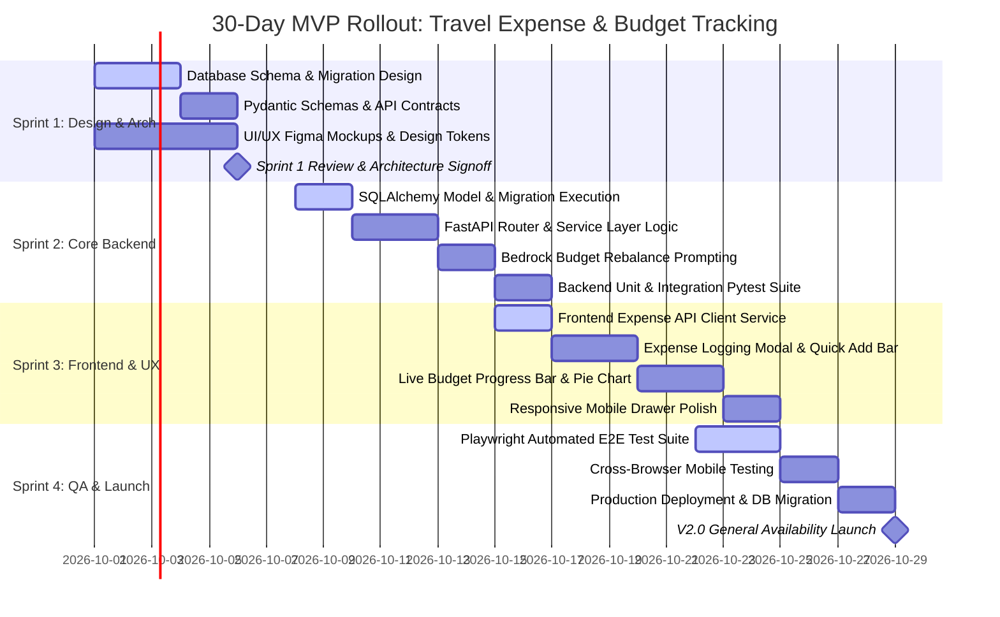

# KelanaAI Future Improvements & V2.0 Roadmap

> **Target Audience:** Product Leaders, Engineering Managers, Systems Architects, and Technical Stakeholders.  
> **Core Objective:** Evaluate candidate features against business value, product vision, architectural readiness, and technical feasibility. Select **ONE** champion feature for Version 2.0 and provide an actionable, end-to-end execution plan to ship a production-grade MVP within **30 days**.

---

## 1. Feature Selection & Justification Matrix

### 1.1. The Candidate Pool
The product team evaluated eight potential feature additions for KelanaAI:
1. **Multi-language Itineraries** (Localized generation in Japanese, Indonesian, French, etc.)
2. **AI Image Generation** (Photorealistic destination previews via Amazon Titan Image Generator)
3. **Email Itinerary Sharing** (PDF generation and transactional email dispatch)
4. **Real-Time Travel Expense & Budget Tracking** (Logging actual spends, live burn-down charts, variance tracking against AI estimates)
5. **Team Trip Planning** (Multi-user collaborative itinerary editing with WebSocket locks)
6. **Hotel Recommendations & Booking Links** (Live hotel search and affiliate booking integration)
7. **Flight Search & Price Alerts** (Global Distribution System / OTA flight aggregations)
8. **Voice-Based AI Assistant** (Real-time speech-to-text and voice synthesis via WebRTC/Whisper/Polly)

---

### 1.2. The Champion Feature for V2.0
🏆 **Selected Feature: Real-Time Travel Expense & Budget Tracking**

> **Core Value Proposition:** *"Close the loop between dream and reality: plan your budget with AI, track your actual spend on the go, and never run out of money mid-trip."*

#### Strategic Fit & Product Vision Alignment
Currently, KelanaAI is predominantly a **pre-trip planning tool**: a traveler uses it for 15 minutes before departing, generates an itinerary, and may not return until their next holiday.

**Travel Expense Tracking fundamentally transforms KelanaAI into an active daily companion**:
- **Drives In-Trip Daily Active Usage (DAU):** Travelers open the application multiple times each day while abroad to log meals, transit fares, and museum admissions.
- **Capitalizes on Existing Architecture:** KelanaAI already computes deterministic `daily_budget` metrics and categorizes trips into `Backpacker`, `Standard`, and `Luxury`. Furthermore, Amazon Bedrock already produces a detailed `budget_breakdown` for accommodation, food, transit, and activities in its day-by-day JSON generation.
- **Solves the #1 Traveler Pain Point:** Overspending is the most common source of travel stress. Connecting planned budget ceilings to real-time expense telemetry provides immediate, tangible value.

---

### 1.3. Technical Feasibility & Current Codebase Readiness

The existing KelanaAI architecture is remarkably primed for this feature with minimal architectural friction:

| Tier | Codebase Readiness | Modifications Required |
| :--- | :--- | :--- |
| **Database (`backend/models/`)** | **High:** Existing `trips` table already stores `budget`, `daily_budget`, and `category`. | Add an `expenses` relational table with a foreign key to `trips.id` (`ondelete="CASCADE"`). |
| **Business Logic (`services/trip_service.py`)** | **Very High:** Existing functions already calculate `calculate_total_cost()` and `is_budget_exceeded()`. | Add aggregation functions: `calculate_remaining_budget()`, `get_category_spending_breakdown()`, and `get_budget_health_status()`. |
| **API Layer (`backend/routers/`)** | **High:** Proven REST routing patterns in `routers/conversations.py` and `main.py`. | Introduce a modular `routers/expenses.py` router mounted under `/api/v1/trips/{trip_id}/expenses`. |
| **Auth & Security (`services/dependencies.py`)** | **Complete:** `get_current_user` dependency and ownership validation patterns are already implemented. | Enforce `trip.user_id == current_user.id` on all expense mutations. |
| **AI Layer (`services/bedrock_service.py`)** | **High:** Bedrock Converse API pipeline is operational. | Add lightweight prompt for automated budget variance diagnosis (*"You are 20% over budget on food in Tokyo—here is how to adjust Days 4 and 5"*). |
| **Frontend (`frontend/app/trips/`)** | **High:** Existing trip dashboards and React state hooks (`useState`, `useToast`). | Add an interactive Expense Drawer/Modal, budget progress bars, and category breakdown badges. |

---

### 1.4. Business Impact vs. Effort (Comparison with Runner-Up Candidates)

To validate this choice, we benchmarked **Travel Expense Tracking** against three prominent runner-ups:

| Candidate Feature | Business Value & Retention | Technical Feasibility & Risk | Third-Party Dependencies | 30-Day Feasibility | Decision |
| :--- | :--- | :--- | :--- | :--- | :--- |
| **Real-Time Travel Expense Tracking** | **Highest (Daily In-Trip DAU):** Converts one-off planners into daily active users; unlocks premium monetization. | **High:** Pure database extension + simple math + responsive frontend logging. | **Zero:** Completely self-contained within Postgres + FastAPI. | **100% Achievable:** Clean CRUD + aggregations + UI components. | **CHAMPION (Selected)** |
| **Flight Search & Price Alerts** | **Medium:** High user interest, but travelers often book directly on airlines or Google Flights. | **Very Low:** Massive complexity (GDS integration, rate-limiting, inventory staleness, caching). | **High:** Requires costly APIs (Amadeus / Skyscanner / Duffel) with complex licensing. | **0% (Unrealistic):** Minimum 3–6 months for compliance and integration. | **Rejected** |
| **Voice-Based AI Assistant** | **Low–Medium:** High novelty, but limited real-world utility in noisy airports or bustling streets. | **Medium:** Requires low-latency audio streaming, WebRTC, Whisper STT, and Amazon Polly TTS. | **High:** Audio streaming infrastructure and multi-browser microphone permissions. | **30% (High Risk):** Prone to latency bottlenecks and mobile Safari quirks. | **Rejected** |
| **Multi-Language Itineraries** | **Medium:** Expands global accessibility, but doesn't solve in-trip retention. | **High:** Can be achieved largely via system prompt adjustments in Bedrock. | **Low:** Utilizes existing Bedrock Converse API runtime. | **90% Achievable:** Low complexity, but yields minimal engagement boost. | **Deferred to V2.1** |

---

## 2. V2.0 Roadmap & 30-Day MVP Plan

---

### 2.1. V2.0 Vision & Full Scope (Long-Term End State)
The ultimate vision for KelanaAI Expense Intelligence is a comprehensive financial co-pilot:
- **Receipt OCR Scanning:** Snap a photo of a receipt in Tokyo (written in Kanji); Amazon Textract/Bedrock extracts the items, translates them to English, converts JPY to USD, and logs the expense.
- **Dynamic Multi-Currency Conversion:** Automatic foreign exchange rate synchronization via European Central Bank or OpenExchangeRates APIs.
- **Predictive AI Budget Re-balancing:** If a user splurges on a Michelin-star dinner on Day 2, Amazon Bedrock dynamically re-plans Days 3–5 to keep the total vacation cost under budget.
- **Split Expenses & Group Settlement:** Support for group trips with "who paid what" ledger tracking (Splitwise-style).

---

### 2.2. MVP Scope Boundary (Strict 30-Day Delivery)

To guarantee deployment within 30 days, we draw clear boundaries between the MVP and post-MVP enhancements:

```
┌─────────────────────────────────────────────────────────────────────────────┐
│                          30-DAY MVP IN-SCOPE                                │
├─────────────────────────────────────────────────────────────────────────────┤
│  ✓ Manual Expense Logging (Amount, Category, Date, Note)                    │
│  ✓ Core Categories: Accommodation, Food & Dining, Transport, Activities,    │
│    Miscellaneous                                                            │
│  ✓ Live Budget Health Bar (Total Spent vs. Total Budget % indicator)        │
│  ✓ Daily Burn-Down Metric (Daily Average Spent vs. Daily Planned Target)     │
│  ✓ Category Spending Breakdown Chart (Visual progress bars / percentages)   │
│  ✓ Full CRUD Operations (Add, Edit, Delete Expense entries)                 │
│  ✓ Multi-Tenant Isolation & Ownership Enforcement (Strict user isolation)  │
│  ✓ AI Budget Warning Advisor (On-demand Bedrock budget recovery advice)     │
└─────────────────────────────────────────────────────────────────────────────┘
                                      │
                                      ▼
┌─────────────────────────────────────────────────────────────────────────────┐
│                        OUT-OF-SCOPE FOR 30-DAY MVP                          │
├─────────────────────────────────────────────────────────────────────────────┤
│  ✗ Optical Character Recognition (OCR) receipt photo uploads                │
│  ✗ Live automated multi-currency conversion (MVP uses primary trip currency) │
│  ✗ Multi-user split bill calculation / shared wallets                       │
│  ✗ Bank account / credit card automated sync (Plaid integration)            │
│  ✗ Native mobile iOS/Android apps (MVP is fully responsive mobile web)      │
└─────────────────────────────────────────────────────────────────────────────┘
```

---

### 2.3. Detailed Feature Specifications

#### 2.3.1. User Stories
1. **Log Daily Expense:** *"As a traveler exploring Tokyo, I want to quickly record an expense ($18 for ramen) on my phone in under 5 seconds, so that I don't forget my cash spends."*
2. **Monitor Budget Burn-Down:** *"As a budget traveler, I want to see how much of my daily $240 allowance I have spent today, so that I know if I can afford a cocktail tonight."*
3. **Category Breakdown:** *"As a planner, I want to see what percentage of my funds has gone to transit versus food, so that I can identify where my money is actually going."*
4. **AI Adjustment Advice:** *"As an overspent traveler, I want to ask the AI assistant how to adjust my remaining days to stay within my total $1,200 cap without ruining my trip."*

---

#### 2.3.2. Database Schema Modifications
We introduce the `expenses` table into the relational PostgreSQL database, linked via a cascading foreign key to `trips.id`:

```sql
-- Migration: Add expenses table
CREATE TABLE expenses (
    id SERIAL PRIMARY KEY,
    trip_id INTEGER NOT NULL REFERENCES trips(id) ON DELETE CASCADE,
    category VARCHAR(32) NOT NULL, -- 'Accommodation', 'Food', 'Transport', 'Activities', 'Miscellaneous'
    amount NUMERIC(10, 2) NOT NULL,
    date DATE NOT NULL DEFAULT CURRENT_DATE,
    note VARCHAR(255) NULL,
    created_at TIMESTAMP WITH TIME ZONE DEFAULT NOW() NOT NULL
);

-- Indexes for high-performance aggregation queries
CREATE INDEX idx_expenses_trip_id ON expenses(trip_id);
CREATE INDEX idx_expenses_date ON expenses(trip_id, date);
CREATE INDEX idx_expenses_category ON expenses(trip_id, category);
```

**SQLAlchemy ORM Model (`backend/models/expense.py`):**
```python
from sqlalchemy import Column, Integer, String, Numeric, Date, DateTime, ForeignKey
from sqlalchemy.sql import func
from sqlalchemy.orm import relationship
from database import Base

class Expense(Base):
    __tablename__ = "expenses"

    id         = Column(Integer, primary_key=True, autoincrement=True)
    trip_id    = Column(Integer, ForeignKey("trips.id", ondelete="CASCADE"), nullable=False, index=True)
    category   = Column(String(32), nullable=False)
    amount     = Column(Numeric(10, 2), nullable=False)
    date       = Column(Date, nullable=False, server_default=func.current_date())
    note       = Column(String(255), nullable=True)
    created_at = Column(DateTime(timezone=True), server_default=func.now(), nullable=False)

    trip = relationship("Trip", back_populates="expenses")
```

---

#### 2.3.3. API Endpoint Specifications

A dedicated router `backend/routers/expenses.py` mounted at `/api/v1/trips/{trip_id}/expenses`:

| Method | Endpoint | Description | Auth Required |
| :--- | :--- | :--- | :--- |
| `POST` | `/api/v1/trips/{trip_id}/expenses` | Log a new expense entry | Bearer JWT (Ownership verified) |
| `GET` | `/api/v1/trips/{trip_id}/expenses` | List all logged expenses for a trip | Bearer JWT (Ownership verified) |
| `DELETE`| `/api/v1/trips/{trip_id}/expenses/{id}`| Delete an expense entry | Bearer JWT (Ownership verified) |
| `GET` | `/api/v1/trips/{trip_id}/budget-summary` | Get aggregated spend vs budget metrics | Bearer JWT (Ownership verified) |
| `POST` | `/api/v1/trips/{trip_id}/ai-budget-rebalance`| AI recommendation to rebalance overspends | Bearer JWT (Ownership verified) |

**Pydantic Schemas:**
```python
class ExpenseCreate(BaseModel):
    category: Literal["Accommodation", "Food", "Transport", "Activities", "Miscellaneous"]
    amount: float = Field(..., gt=0, description="Expense amount in trip currency")
    date: date = Field(default_factory=date.today)
    note: Optional[str] = Field(None, max_length=255)

class ExpenseResponse(BaseModel):
    id: int
    trip_id: int
    category: str
    amount: float
    date: date
    note: Optional[str]
    created_at: datetime

class BudgetSummaryResponse(BaseModel):
    total_budget: float
    total_spent: float
    remaining_budget: float
    percentage_spent: float
    is_over_budget: bool
    daily_budget_target: float
    daily_actual_average: float
    category_breakdown: Dict[str, float]
```

---

#### 2.3.4. AI Budget Rebalance Integration
When `POST /api/v1/trips/{trip_id}/ai-budget-rebalance` is called, the business logic calculates budget variance:
$$\text{Variance} = \text{Total Spent} - (\text{Elapsed Days} \times \text{Daily Budget Target})$$

If variance $> 0$, the backend constructs a specialized prompt for **Amazon Bedrock Nova Lite**:
```text
Traveler Trip Context:
- Destination: Tokyo
- Total Budget: $1,200.00
- Days: 5 (Currently on Day 3)
- Total Spent So Far: $850.00 (Planned for 3 days: $720.00)
- Overspent by: $130.00 (Primary overspend category: Food & Dining)
- Remaining Budget: $350.00 for 2 remaining days ($175.00/day)

Provide 3 specific, realistic trade-offs for Days 4 and 5 in Tokyo to recover the $130.00 variance without sacrificing key experiences.
```

---

### 2.4. 30-Day Execution Timeline (4 Weekly Sprints)



---

#### Sprint 1 (Days 1–7): Design, Architecture & Contracts
- **Deliverables:**
  - Database schema migration script drafted (`backend/migrate.py` update).
  - Formal OpenAPI contract published with Pydantic request/response models.
  - Interactive UI mockups for Desktop and Mobile (Expense Drawer, Budget Health Pill, Category Spending Chart).
  - Security review: Verification of tenant isolation and ownership guards.

#### Sprint 2 (Days 8–14): Core Backend & AI Engine
- **Deliverables:**
  - Neon PostgreSQL migration applied; `expenses` table created with indexes.
  - `routers/expenses.py` implemented with CRUD endpoints and aggregation calculations.
  - Unit tests covering edge cases: zero expenses, exceeding budget, division by zero days.
  - Bedrock prompt engineering for budget recovery advice integrated into `bedrock_service.py`.

#### Sprint 3 (Days 15–21): Frontend & User Experience
- **Deliverables:**
  - `frontend/services/expenseService.ts` created using `authenticatedFetch`.
  - Responsive **"Quick Log"** floating action button for mobile users.
  - Interactive **Budget Burn-Down Bar** displaying percentage spent with dynamic color coding (Green: $<80\%$, Amber: $80-100\%$, Red: $>100\%$).
  - Category breakdown visualization and expense transaction history table.

#### Sprint 4 (Days 22–30): Verification, Security, & Launch
- **Deliverables:**
  - Automated Playwright end-to-end tests validating the complete user flow (create trip $\to$ log expenses $\to$ assert budget health $\to$ delete expense).
  - Performance benchmarking: Verify that budget aggregation endpoint responds in $<45\text{ ms}$.
  - Deployment to FastApiCloud / PaaS and Vercel production environments.
  - Product launch communication and updated documentation.

---

## 3. Post-MVP Evolution & 90-Day Vision

Following the successful release of the 30-Day MVP, subsequent iterations scale the platform into a collaborative, offline-resilient travel suite:
1. **Phase 1 (Days 1–30):** Core Expense MVP + Multimodal Receipt OCR scanning & live multi-currency conversion.
2. **Phase 2 (Days 31–60):** Team Trip Planning & Split Expense settlement (viral group collaboration).
3. **Phase 3 (Days 61–90):** Progressive Web App (PWA) with offline synchronization & multi-model LLM failover.

👉 **For the complete 90-day technical architecture, database schemas, Pydantic contracts, and Gantt charts, see [`docs/v2-roadmap.md`](./v2-roadmap.md).**
