# AI Response Evaluation Report: RAG vs. Base Model

* **Evaluation Domain:** Travel & Tourism Assistant (KelanaAI)
* **Evaluator Role:** AI Response Evaluator
* **Source Test Suite:** [`docs/questions.md`](./questions.md)
* **Date:** 2026-09-07
* **Evaluated Approaches:**
  1. **Base Model (Parametric Knowledge Only):** Standalone LLM generation relying entirely on pre-trained weights without external search or document grounding.
  2. **RAG System (Retrieval-Augmented Generation):** Retrieval pipeline (e.g., Amazon Bedrock Knowledge Base / Vector Store) injecting verified domain documents, regulatory circulars, and structured tourism data into the generation context.

---

## 1. Executive Summary & Core Metrics

| Evaluation Metric | Base Model (Zero-Shot / Parametric) | RAG System (Retrieval-Augmented) | Net Improvement Achieved by RAG |
| :--- | :--- | :--- | :--- |
| **Factual Accuracy** | **Moderate to Low:** Prone to outdated currency thresholds, obsolete visa rules, and approximate policy guidelines. | **High:** Extracts verified, current statutory numbers, official authority names, and exact legal thresholds. | **Elimination of factual drift**; ensures compliance with current regional and international laws. |
| **Hallucination Rate** | **Elevated:** Confuses statutory reporting requirements with complete bans; invents non-existent transit privileges or procedures. | **Near Zero:** Grounded within retrieved document chunks with similarity threshold filtering (`score > 0.85`). | **Mitigated critical hallucinations** (especially regarding legal penalties and customs violations). |
| **Contextual Relevance & Constraints** | **Inconsistent:** Tendency to generate generic "top attractions" that violate negative constraints (e.g., steep steps for elderly). | **Strict:** Retrieval matches query tags directly to accessibility, terrain, and pacing criteria. | **Personalized and safe recommendations** that respect physical constraints. |
| **Citation & Auditability** | **None:** Generates plausibly worded claims with no verifiable source or document metadata. | **Complete:** Provides document IDs, source passages, confidence scores, and authority references. | **Traceable provenance**, critical for user trust and compliance verification. |

---

## 2. Side-by-Side Test Case Evaluation

---

### Test Case 1: Factual Inquiry (Regulatory & Currency Limits)

* **Question:**
  > *"What is the maximum amount of foreign currency or cash an international traveler can bring into Indonesia without having to submit an official customs declaration or obtain prior central bank approval?"*
* **Complexity:** Low – Medium (Factual / Numerical Retrieval)

#### Side-by-Side Comparison

```
┌──────────────────────────────────────────────────────────┬──────────────────────────────────────────────────────────┐
│ Base Model (Parametric)                                  │ RAG System (Knowledge Base Grounded)                     │
├──────────────────────────────────────────────────────────┼──────────────────────────────────────────────────────────┤
│ "Generally, travelers can bring up to USD $10,000 or     │ "Under Bank Indonesia Regulation (PBI No. 19/7/PBI/2017) │
│ equivalent before declaring. In Indonesia, the limit     │ and Directorate General of Customs and Excise (Bea       │
│ is around IDR 100,000,000. If you bring more, you must   │ Cukai) rules:                                            │
│ pay a tax on arrival at customs."                        │                                                          │
│                                                          │ 1. Customs Declaration (e-CD): Travelers carrying cash   │
│                                                          │    or foreign currency instruments equivalent to or      │
│                                                          │    exceeding IDR 100,000,000 must declare it upon        │
│                                                          │    arrival. No tax or duty is owed simply for declaring. │
│                                                          │ 2. Central Bank Approval: Carrying cash exceeding        │
│                                                          │    IDR 1,000,000,000 (or foreign currency equivalent)    │
│                                                          │    strictly requires prior authorization and a license   │
│                                                          │    from Bank Indonesia; unauthorized excess is subject   │
│                                                          │    to confiscation and statutory fines."                 │
└──────────────────────────────────────────────────────────┴──────────────────────────────────────────────────────────┘
```

#### Key Improvements Documented
* **Factual Accuracy:** The base model misclassified customs reporting as a taxable event ("pay a tax on arrival"). RAG correctly stated that reporting on the Electronic Customs Declaration (e-CD) does not incur duty.
* **Contextual Relevance:** RAG accurately captured the two distinct tiers: the **IDR 100M customs declaration trigger** and the **IDR 1B Bank Indonesia statutory license threshold**.
* **Reduction of Hallucinations:** Prevented erroneous financial advice regarding non-existent import duties on currency.

---

### Test Case 2: Policy Edge-Case (Restricted Personal Medication)

* **Question:**
  > *"Can a traveler legally bring prescribed stimulant medication (such as methylphenidate or Adderall) into Japan for personal use during a 2-week vacation, and what advance permits or certificates are mandatory before departure?"*
* **Complexity:** High (Strict Policy & Compliance Edge-Case)

#### Side-by-Side Comparison

```
┌──────────────────────────────────────────────────────────┬──────────────────────────────────────────────────────────┐
│ Base Model (Parametric)                                  │ RAG System (Knowledge Base Grounded)                     │
├──────────────────────────────────────────────────────────┼──────────────────────────────────────────────────────────┤
│ "Yes, you can bring your prescribed medications into     │ "Strict distinction is required under Japan's Narcotics  │
│ Japan as long as you carry your doctor's prescription,   │ and Psychotropics Control Act:                           │
│ keep it in original packaging, and do not carry more     │                                                          │
│ than a 30-day supply. You may need to declare it at      │ 1. Prohibited (Adderall / Amphetamines): Adderall and    │
│ customs when landing."                                   │    dextroamphetamine are strictly illegal in Japan. They │
│                                                          │    CANNOT be brought into the country under any          │
│                                                          │    circumstance, even with a valid foreign prescription. │
│                                                          │ 2. Controlled / Psychotropics (Methylphenidate/Ritalin): │
│                                                          │    Permitted up to 2.16g active ingredient for personal  │
│                                                          │    use. Advance permission ('Yakkan Shoumei' / Yunyu     │
│                                                          │    Kakunin-sho) from the Regional Bureau of Health and   │
│                                                          │    Welfare is mandatory prior to departure."             │
└──────────────────────────────────────────────────────────┴──────────────────────────────────────────────────────────┘
```

#### Key Improvements Documented
* **Safety & Regulatory Compliance:** The base model's blanket permission represents a severe safety hazard that could lead to immediate detention or arrest in Japan.
* **Contextual Nuance:** RAG clearly separated amphetamine-class medications (categorically banned) from methylphenidate (permitted under strict dosage ceilings with advance certification).
* **Process Accuracy:** RAG correctly cited the official certification mechanism (*Yakkan Shoumei / Yunyu Kakunin-sho*) and designated Japanese authority (Regional Bureau of Health and Welfare).

---

### Test Case 3: Multi-Constraint Itinerary Recommendation

* **Question:**
  > *"Create a 3-day cultural and culinary itinerary in Yogyakarta specifically tailored for elderly travelers with limited mobility. Avoid steep stair climbs or rugged walking paths, include wheelchair-accessible spots, and suggest relaxed pacing with minimal transit times."*
* **Complexity:** High (Multi-Constraint Reasoning & Spatial Logic)

#### Side-by-Side Comparison

```
┌──────────────────────────────────────────────────────────┬──────────────────────────────────────────────────────────┐
│ Base Model (Parametric)                                  │ RAG System (Knowledge Base Grounded)                     │
├──────────────────────────────────────────────────────────┼──────────────────────────────────────────────────────────┤
│ Day 1: Sunrise climb up Borobudur Temple stairs,         │ Day 1: Keraton Yogyakarta (Ground courtyards, flat paved │
│ followed by Malioboro street walk.                       │ stone ramps) + Seated traditional Gudeg Yu Djum lunch.   │
│ Day 2: Prambanan Temple complex tour and hiking around   │ Afternoon rest. Evening Ramayana Ballet at Purawisata    │
│ Mount Merapi Lava Tour in an open jeep.                  │ (Reserved amphitheater seating, step-free access).       │
│ Day 3: Exploring Goa Pindul cave tubing and visiting     │ Day 2: Borobudur Temple Ground Park & Museum only (step- │
│ Taman Sari Water Castle underground tunnels.             │ free golf cart transit, avoiding temple tier stairs) +   │
│                                                          │ seated Silver Workshop in Kotagede with vehicle drop-off.│
│                                                          │ Day 3: Private accessible Batik Pavilion class + relaxed │
│                                                          │ sunset tea at Plataran Shailendra with car access.       │
└──────────────────────────────────────────────────────────┴──────────────────────────────────────────────────────────┘
```

#### Key Improvements Documented
* **Negative Constraint Satisfaction:** The base model failed all negative constraints, suggesting strenuous stair climbs (Borobudur temple monument), rugged jeep rides (Merapi), and water tubing (Goa Pindul).
* **Accessibility Context:** RAG utilized ground accessibility metadata, replacing stone stair climbs with ground-level golf-cart tours and prioritizing seated, vehicle-accessible cultural venues.
* **Pacing:** RAG respected circadian pacing for senior travelers by incorporating dedicated afternoon rest blocks.

---

### Test Case 4: Transit Logistics & Immigration Rules (Separate Tickets)

* **Question:**
  > *"I have a self-transfer layover of 7 hours between Terminal 2 and Terminal 4 at London Heathrow (LHR) booked on two separate airline tickets. Do I have to pass through UK Border Control to collect and re-check my luggage, and what type of transit visa is needed if my nationality is not visa-exempt?"*
* **Complexity:** Medium – High (Logistics & Visa Disambiguation)

#### Side-by-Side Comparison

```
┌──────────────────────────────────────────────────────────┬──────────────────────────────────────────────────────────┐
│ Base Model (Parametric)                                  │ RAG System (Knowledge Base Grounded)                     │
├──────────────────────────────────────────────────────────┼──────────────────────────────────────────────────────────┤
│ "Because your layover is only 7 hours, you can stay      │ "Because you booked two separate tickets (self-transfer):│
│ airside and take the Heathrow flight connection bus      │                                                          │
│ between T2 and T4 without passing immigration. You can   │ 1. Baggage & Border Control: Airlines cannot check bags  │
│ simply apply for a Direct Airside Transit Visa (DATV)."  │    through on separate itineraries. You MUST clear UK    │
│                                                          │    Border Control (enter the UK landside), collect your  │
│                                                          │    bags from Baggage Reclaim, transfer terminals via the │
│                                                          │    Elizabeth line/train, and re-check in landside.       │
│                                                          │ 2. Visa Requirement: A Direct Airside Transit Visa       │
│                                                          │    (DATV) is INVALID for landside entry. Non-exempt      │
│                                                          │    nationals MUST hold a 'Visitor in Transit visa' or    │
│                                                          │    qualify under the Transit Without Visa (TWOV) scheme."│
└──────────────────────────────────────────────────────────┴──────────────────────────────────────────────────────────┘
```

#### Key Improvements Documented
* **Logistical Domain Grounding:** Base model assumed all airport transfers can be completed airside. RAG understood the physical constraints of self-transfers on separate tickets (baggage must be reclaimed in the landside arrivals hall).
* **Visa Disambiguation:** RAG explicitly corrected the common misconception between an airside visa (DATV) and a landside transit visa (*Visitor in Transit*), preventing denied boarding.

---

### Test Case 5: Consumer Rights & Disruption Policies (EU261 / Force Majeure)

* **Question:**
  > *"Under EU Regulation 261/2004, what are an airline's obligations regarding cash compensation versus hotel accommodation if a flight from Paris (CDG) to Bali is delayed overnight due to sudden volcanic ash airspace closure versus an airline technical maintenance issue?"*
* **Complexity:** High (Legal Comparison & Conditional Disambiguation)

#### Side-by-Side Comparison

```
┌──────────────────────────────────────────────────────────┬──────────────────────────────────────────────────────────┐
│ Base Model (Parametric)                                  │ RAG System (Knowledge Base Grounded)                     │
├──────────────────────────────────────────────────────────┼──────────────────────────────────────────────────────────┤
│ "If the delay is caused by volcanic ash, it is an act    │ "Under EC 261/2004 (Article 5, 7, and 9):                │
│ of God, so the airline has no responsibility to provide  │                                                          │
│ a hotel or cash compensation. For maintenance issues,    │ 1. Duty of Care (Article 9 - Hotel, Meals, Transport):   │
│ they must pay you compensation of €600."                 │    MANDATORY in BOTH scenarios. Even during volcanic     │
│                                                          │    ash closures, the airline must provide complimentary  │
│                                                          │    hotel accommodation and food until the next flight.   │
│                                                          │ 2. Monetary Compensation (Article 7 - Up to €600):       │
│                                                          │    - Technical Issue: PAYABLE (€600 for flights >3,500km)│
│                                                          │      as maintenance is inherent in normal operations.    │
│                                                          │    - Volcanic Ash: EXEMPT under Article 5(3) as an       │
│                                                          │      'extraordinary circumstance' beyond carrier control.│
└──────────────────────────────────────────────────────────┴──────────────────────────────────────────────────────────┘
```

#### Key Improvements Documented
* **Legal Grounding:** Overturned the common fallacy that force majeure excuses airlines from the statutory **Duty of Care**.
* **Statutory Breakdown:** Correctly cited Article 9 (Duty of Care — non-waivable) versus Article 7 (Fixed Financial Compensation — waivable under Article 5(3) extraordinary circumstances).

---

## 3. Architecture Comparison

```mermaid
flowchart TD
    subgraph Base_LLM["Base Model (Parametric Alone)"]
        A1["User Question"] --> A2["Pre-trained Weights Memory"]
        A2 --> A3["Generalization & Statistical Guessing"]
        A3 --> A4["Potential Hallucinations & Policy Risks"]
    end

    subgraph RAG_Pipeline["KelanaAI RAG Pipeline"]
        B1["User Question"] --> B2["Bedrock Knowledge Base Vector Retrieval"]
        B2 --> B3["Similarity Filtering (Score > 0.85)"]
        B3 --> B4["Augmented Prompt + Document Chunks"]
        B4 --> B5["Grounded Generation with Source Attribution"]
    end
```



---

## 4. Recommendations for QA & Development

1. **Similarity Score Optimization:** Continue enforcing the similarity cutoff (`score > 0.85` in `kb_service.py`) to prevent marginally relevant chunks from injecting noise into strict policy queries.
2. **Fallback Strategy:** When similarity score is below threshold, the system should explicitly state that official documents could not be matched, rather than allowing the base model to guess ungrounded legal/medical advice.
3. **Structured Metadata Display:** Present document sources, last updated timestamps, and issuing government authorities directly in the UI assistant panel to reinforce transparency and trust.
