# KelanaAI End-to-End User Journey

> **Target Audience:** Systems Architects, Engineers, Product Managers, and Stakeholders.  
> **Core Narrative Objective:** *"Audiences remember stories, not diagrams."*  
> This document follows a single, continuous user story demonstrating how every component across the 8-tier KelanaAI architecture activates, coordinates, and delivers value in a real-world scenario.

---

## The Persona & Scenario

**Meet Maya**, a 28-year-old freelance digital designer and solo traveler from Singapore planning a **5-day cultural and culinary exploration of Tokyo** on a **$1,200 USD budget**. 

Maya has three primary objectives:
1. Obtain an automated, realistic day-by-day travel itinerary tailored to her exact budget style.
2. Verify strict statutory travel regulations regarding bringing personal prescription medication into Japan through customs.
3. Brainstorm neighborhood walking routes and hidden coffee spots through an ongoing, multi-turn AI travel companion chat.

Below is Maya's complete end-to-end journey through the 8 sequential stages of KelanaAI.

---

## High-Level Journey Flowchart

```mermaid
flowchart TD
    subgraph S1["Step 1: Register"]
        A["Maya creates account<br/>(Name, Email, Password)"] --> B["Bcrypt password hash<br/>Save to 'users' table"]
    end

    subgraph S2["Step 2: Login"]
        B --> C["Authenticate credentials<br/>Issue signed JWT (HS256)"]
        C --> D["Store JWT in localStorage<br/>Hydrate UserContext (/profile/me)"]
    end

    subgraph S3["Step 3: Generate"]
        D --> E["Submit Tokyo trip<br/>(5 Days, $1,200 USD)"]
        E --> F["Invoke Bedrock Converse API<br/>(amazon.nova-lite-v1:0)"]
    end

    subgraph S4["Step 4: Save"]
        F --> G["Regex code fence strip & JSON parse"]
        G --> H["Persist to 'trips.ai_recommendation'<br/>Render multi-day itinerary cards"]
    end

    subgraph S5["Step 5: Ask"]
        H --> I["Maya queries customs rules<br/>('Can I bring prescription meds?')"]
    end

    subgraph S6["Step 6: Retrieve"]
        I --> J["Bedrock Agent Runtime vector search<br/>Filter score > 0.85 & extract citations"]
        J --> K["Return grounded regulatory answer<br/>(Zero hallucination + source links)"]
    end

    subgraph S7["Step 7: Continue"]
        K --> L["Multi-turn chat in /chat<br/>Persist conversation & messages"]
        L --> M["Format history for Bedrock<br/>Sliding-window compactor (>500 msgs)"]
    end

    subgraph S8["Step 8: View"]
        M --> N["Review saved trips, chat threads<br/>Audit profile & trip telemetry"]
    end
```



---

## Step-by-Step Narrative

---

### Step 1: Register (Onboarding & Identity Creation)

> [!NOTE]
> **In the Architecture Diagram, this step lives here:**  
> `Layer 1 (User / Client)` $\longrightarrow$ `Layer 2 (Next.js / Presentation)` $\longrightarrow$ `Layer 3 (FastAPI / Gateway)` $\longrightarrow$ `Layer 4 (Auth Layer)` $\longrightarrow$ `Layer 8 (Postgres / Data)`

#### The User's Perspective
Maya lands on the KelanaAI homepage (`https://kelana-ai-five.vercel.app/`). Impressed by the clean, responsive interface, she clicks the **"Get Started"** button in the navigation header, which routes her to `/register`. 

She is greeted by a streamlined registration card. Maya inputs:
- **Full Name:** `Maya Tan`
- **Email:** `maya.tan@example.com`
- **Password:** `TokyoAdventure2026!`

She clicks **"Create Account"**. The button enters a loading state with a subtle spinner, providing instant feedback that her registration request is in flight.

#### Under the Hood
1. **Presentation Layer (`frontend/app/register/page.tsx` & `frontend/services/authService.ts`):**
   - Form inputs are captured in local React component state.
   - Client-side validation checks that the email matches valid format patterns and that the password is not empty.
   - `authService.register()` sends an asynchronous HTTP POST request to the API:
     ```http
     POST https://kelana-ai-cc9cb4d7.fastapicloud.dev/api/v1/auth/register
     Content-Type: application/json

     {
       "name": "Maya Tan",
       "email": "maya.tan@example.com",
       "password": "TokyoAdventure2026!"
     }
     ```

2. **API Gateway & Routing (`backend/main.py` & `backend/routers/auth.py`):**
   - The Uvicorn ASGI server receives the request and forwards it to the router mounted at `/api/v1/auth`.
   - Pydantic's `RegisterRequest` validates the incoming JSON against strict schema boundaries:
     ```python
     class RegisterRequest(BaseModel):
         name: str
         email: EmailStr
         password: str
     ```
   - If invalid, the custom `RequestValidationError` handler instantly responds with HTTP 400.

3. **Auth & Security Layer (`backend/services/auth_service.py`):**
   - `auth_service.register()` queries the database using SQLAlchemy to ensure email uniqueness:
     ```python
     existing = db.query(User).filter(User.email == email).first()
     if existing:
         raise HTTPException(status_code=409, detail="Email already registered")
     ```
   - Passwords are **never** stored in plaintext. The service invokes `bcrypt.hashpw()` with an auto-generated cryptographic salt (`bcrypt.gensalt()`), producing a 60-character one-way hash string:
     ```text
     $2b$12$e8Y7zH.Z5m5Y1vO... (irreversible bcrypt digest)
     ```

4. **Data Persistence (`backend/models/user.py` & `backend/database.py`):**
   - A new `User` ORM entity is instantiated and committed to Neon Serverless PostgreSQL:
     ```sql
     INSERT INTO users (name, email, password_hash)
     VALUES ('Maya Tan', 'maya.tan@example.com', '$2b$12$...')
     RETURNING users.id;
     ```
   - Neon assigns auto-increment primary key `id = 14`.
   - The registration workflow immediately calls `auth_service.login()` to issue Maya her initial access token, returning HTTP 201 Created:
     ```json
     {
       "access_token": "eyJhbGciOiJIUzI1NiIsInR5cCI6IkpXVCJ9...",
       "token_type": "bearer"
     }
     ```

---

### Step 2: Login (Authentication & Session Initiation)

> [!NOTE]
> **In the Architecture Diagram, this step lives here:**  
> `Layer 1 (User / Client)` $\longrightarrow$ `Layer 2 (Next.js / Presentation)` $\longrightarrow$ `Layer 3 (FastAPI / Gateway)` $\longrightarrow$ `Layer 4 (Auth Layer)` $\longrightarrow$ `Layer 8 (Postgres / Data)`

#### The User's Perspective
Following successful registration (or on subsequent visits to `/login`), Maya submits her credentials. The interface displays a green success banner and smoothly redirects her to her personalized dashboard at `/trips`. 

In the top-right corner of the persistent navigation bar (`Navbar.tsx`), she now sees her profile avatar with her name *"Maya Tan"*, confirming her authenticated session is active.

#### Under the Hood
1. **Credential Dispatch & Verification (`frontend/services/authService.ts` & `backend/routers/auth.py`):**
   - `POST /api/v1/auth/login` is triggered with Maya's email and plaintext password.
   - `auth_service.login()` queries PostgreSQL for `users WHERE email = 'maya.tan@example.com'`.
   - `bcrypt.checkpw()` verifies the supplied password bytes against the stored hash. If invalid, an HTTP 401 Unauthorized is returned with `"Invalid email or password"`.

2. **Cryptographic Token Minting (`backend/services/auth_service.py`):**
   - Upon verification, `python-jose` signs a stateless JWT access token using the HMAC-SHA256 (`HS256`) algorithm and the server's `SECRET_KEY`:
     ```python
     expire = datetime.now(timezone.utc) + timedelta(minutes=1440)  # 24 hours
     token = jwt.encode({"sub": str(user.id), "exp": expire}, SECRET_KEY, algorithm="HS256")
     ```
   - The payload contains:
     ```json
     {
       "sub": "14",
       "exp": 1757345000
     }
     ```

3. **Client Session Initialization & State Hydration (`frontend/lib/apiClient.ts` & `frontend/context/UserContext.tsx`):**
   - The Next.js frontend receives the token and stores it in the browser's `localStorage` under the key `"access_token"`.
   - The root layout's `UserProvider` triggers an immediate profile fetch via `authenticatedFetch(`${API_BASE}/auth/me`)`:
     - `apiClient.ts` reads `"access_token"` from `localStorage` and appends `Authorization: Bearer eyJhbGciOi...` to outgoing headers.
     - FastAPI's `get_current_user` dependency intercepts the request, verifies the token's cryptographic signature, checks that current timestamp $< \text{exp}$, and loads Maya's `User` record.
     - The endpoint returns Maya's identity and live trip count:
       ```json
       {
         "id": 14,
         "name": "Maya Tan",
         "email": "maya.tan@example.com",
         "trip_count": 0
       }
       ```
   - `UserContext` hydrates the global React state, updating the UI navigation without a full page reload.

---

### Step 3: Generate (Initial AI Request / Generation Trigger)

> [!NOTE]
> **In the Architecture Diagram, this step lives here:**  
> `Layer 1 (User / Client)` $\longrightarrow$ `Layer 2 (Next.js / Presentation)` $\longrightarrow$ `Layer 3 (FastAPI / Gateway)` $\longrightarrow$ `Layer 4 (Auth Layer)` $\longrightarrow$ `Layer 5 (Business Logic Layer)` $\longrightarrow$ `Layer 6 (Bedrock Generative AI Layer)`

#### The User's Perspective
Maya navigates to `/trips` and clicks **"+ Plan New Trip"**. A modal dialogue appears requesting her travel parameters. Maya fills in:
- **Destination:** `Tokyo, Japan`
- **Duration:** `5 days`
- **Total Budget:** `$1200`

She clicks **"Save Trip & Generate Plan"**. The interface displays an energetic pulse animation: *"Consulting Amazon Bedrock Nova Lite to craft your custom Tokyo itinerary..."*.

#### Under the Hood
1. **Initial Trip Creation (`backend/main.py` -> `create_trip`):**
   - Next.js calls `POST /api/v1/trips` with `{ "destination": "Tokyo, Japan", "days": 5, "budget": 1200.0 }`.
   - The Auth layer injects Maya as `current_user` (`user_id = 14`).
   - The Business Logic layer (`backend/services/trip_service.py`) calculates deterministic derived metrics:
     $$\text{Daily Budget} = \frac{\$1,200}{5} = \$240.00/\text{day}$$
     $$\text{Category} = \text{"Standard"} \quad (1000 \le \text{Budget} \le 3000)$$
   - The trip record is saved with `Trip.id = 42` and `Trip.user_id = 14`.

2. **Triggering Generation (`backend/main.py` -> `generate_trip_recommendation`):**
   - Next.js immediately dispatches `POST /api/v1/trips/42/generate`.
   - Ownership check: `trip.user_id (14) == current_user.id (14)`. Access is granted.

3. **Prompt Engineering (`backend/services/bedrock_service.py` -> `build_trip_prompt`):**
   - The business logic builds a comprehensive, schema-constrained prompt:
     ```text
     You are a professional travel planner. Create a detailed 5-day trip itinerary for Tokyo, Japan.
     Traveler profile:
     - Budget style: Standard
     - Total budget: $1200.00
     - Daily budget: $240.00

     IMPORTANT: You MUST respond with ONLY a valid JSON array. Do NOT include markdown code fences...
     Return a JSON array where each element represents one day:
     {
       "day": <integer>,
       "title": "<Day X: Theme or area name>",
       "travel_tips": ["..."],
       "local_food": ["..."],
       "budget_breakdown": {
         "accommodation": "...",
         "food": "...",
         "transport": "...",
         "activities": "...",
         "total": "..."
       }
     }
     ```

4. **Amazon Bedrock Model Invocation (`backend/services/bedrock_service.py`):**
   - The backend initializes `boto3.client("bedrock-runtime", region_name="ap-southeast-2")`.
   - The request is dispatched via the **Bedrock Converse API**:
     ```python
     response = client.converse(
         modelId="amazon.nova-lite-v1:0",
         messages=[{"role": "user", "content": [{"text": prompt}]}]
     )
     ```
   - AWS Bedrock processes the token sequence using the Nova Lite foundation model, returning a structured JSON response within 1.8 seconds.

---

### Step 4: Save (Persistence & State Storage)

> [!NOTE]
> **In the Architecture Diagram, this step lives here:**  
> `Layer 5 (Business Logic Layer)` $\longrightarrow$ `Layer 8 (Postgres / Data)` $\longrightarrow$ `Layer 3 (FastAPI / Gateway)` $\longrightarrow$ `Layer 2 (Next.js / Presentation)` $\longrightarrow$ `Layer 1 (User / Client)`

#### The User's Perspective
The loading animation finishes, and Maya's dashboard updates dynamically. 

A structured 5-day travel schedule unfolds before her:
- **Day 1: Arrival & Electric City:** Shinjuku night walk, Omoide Yokocho yakitori, JR Yamanote train tips ($210 spend).
- **Day 2: Historic Asakusa & Ueno Gardens:** Senso-ji temple morning visit, Asakusa soba, Tokyo National Museum ($195 spend).
- **Day 3: Pop Culture & Shibuya Crossing:** Harajuku Meiji Shrine, Shibuya sky view, conveyor belt sushi ($230 spend).
- **Day 4: Tech & Culinary Exploration:** Akihabara electronics, Tsukiji Outer Market fresh seafood bowls ($250 spend).
- **Day 5: Waterfront Odaiba & Departure:** TeamLab Borderless digital art, waterfront ramen, Narita Express transit ($215 spend).

Each card features a budget breakdown pill, categorized transit advice (Train), and specific local eatery suggestions. Maya is thrilled—the itinerary matches her exact $240/day allocation.

#### Under the Hood
1. **Output Sanitization & Schema Validation (`backend/services/bedrock_service.py`):**
   - Bedrock returns the raw text response. In case the LLM included markdown wrappers despite instructions, regex sanitization runs:
     ```python
     cleaned = re.sub(r"^```(?:json)?\s*", "", raw_text.strip(), flags=re.IGNORECASE)
     cleaned = re.sub(r"\s*```$", "", cleaned.strip())
     ai_response = json.loads(cleaned)
     ```
   - The validated Python list contains 5 distinct day dictionaries matching the required schema.

2. **Relational Database Persistence (`backend/main.py` & `backend/database.py`):**
   - The serialized JSON string is stored directly in the `trips` table:
     ```python
     trip.ai_recommendation = json.dumps(ai_response)
     db.commit()
     db.refresh(trip)
     ```
   - Executed SQL on Neon PostgreSQL:
     ```sql
     UPDATE trips
     SET ai_recommendation = '[\n  {\n    "day": 1,\n    "title": "Day 1: Arrival..."\n  }...]'
     WHERE trips.id = 42;
     ```

3. **HTTP Response & React Rendering (`frontend/services/tripService.ts`):**
   - FastAPI returns HTTP 200 OK:
     ```json
     {
       "trip_id": 42,
       "destination": "Tokyo, Japan",
       "recommendation": [...]
     }
     ```
   - Next.js receives the payload and updates the local state in `app/trips/page.tsx`. React 19 renders the interactive itinerary cards with zero client-side page reload.

---

### Step 5: Ask (Follow-Up Contextual Query / RAG Prompt)

> [!NOTE]
> **In the Architecture Diagram, this step lives here:**  
> `Layer 1 (User / Client)` $\longrightarrow$ `Layer 2 (Next.js / Presentation)` $\longrightarrow$ `Layer 3 (FastAPI / Gateway)` $\longrightarrow$ `Layer 5 (Business Logic Layer)` $\longrightarrow$ `Layer 7 (RAG Layer)`

#### The User's Perspective
Looking over her Day 1 packing checklist, Maya realizes she takes daily prescription medication (a mild stimulant for ADHD and a prescribed painkiller). She has heard that Japan has notoriously strict narcotics and stimulants control laws, and she cannot afford to risk detention or confiscation at customs.

She clicks the **"Travel Assistant"** tab in the navigation bar, which takes her to `/assistant`.

In the inquiry box, Maya enters her question:
> *"Can I bring prescription ADHD medication or painkillers into Japan through customs, or do I need an advance import certificate?"*

She clicks **"Ask Assistant"**.

#### Under the Hood
1. **Frontend Dispatch (`frontend/services/assistantService.ts`):**
   - `askQuestion()` trims the input string and initiates an authenticated POST request:
     ```http
     POST https://kelana-ai-cc9cb4d7.fastapicloud.dev/api/v1/ask
     Authorization: Bearer eyJhbGciOi...
     Content-Type: application/json

     {
       "question": "Can I bring prescription ADHD medication or painkillers into Japan through customs, or do I need an advance import certificate?"
     }
     ```

2. **API Ingress & Routing (`backend/main.py` -> `ask_endpoint`):**
   - FastAPI receives the request and validates it with `QuestionRequest`:
     ```python
     class QuestionRequest(BaseModel):
         question: str
     ```
   - The endpoint invokes `ask_knowledge_base(request.question)` in `services/kb_service.py`.

3. **Delegation to Vector Retrieval Pipeline (`backend/services/kb_service.py`):**
   - The RAG service reads `AWS_REGION="ap-southeast-2"` and `KNOWLEDGE_BASE_ID="EW7EM5BPON"` from the environment.
   - It builds an AWS Bedrock Agent Runtime client:
     ```python
     client = boto3.client("bedrock-agent-runtime", region_name=AWS_REGION)
     ```

---

### Step 6: Retrieve (Context Fetch & Vector Search in Action)

> [!NOTE]
> **In the Architecture Diagram, this step lives here:**  
> `Layer 7 (RAG Knowledge Base)` $\longrightarrow$ `Layer 5 (Business Logic)` $\longrightarrow$ `Layer 3 (FastAPI)` $\longrightarrow$ `Layer 2 (Next.js)` $\longrightarrow$ `Layer 1 (User / Client)`

#### The User's Perspective
Within seconds, the Assistant card displays an authoritative, verified answer:

> **Japan Customs & Ministry of Health, Labour and Welfare (MHLW) Regulations:**
> 
> 1. **Prohibited Medications:** Medications containing stimulants such as **Amphetamine and Dextroamphetamine (e.g., Adderall)** are strictly prohibited from entry into Japan under the *Stimulants Control Act*, even with a foreign doctor's prescription.
> 2. **Permitted with Advance Authorization (*Yakkan Shoumei* / Import Certificate):** Psychotropics such as **Methylphenidate (e.g., Ritalin/Concerta)** or certain prescription painkillers may be brought in only if you apply for and obtain an official **Yakkan Shoumei (Import Certificate)** from the Regional Bureau of Health and Welfare prior to arrival.
> 3. **Personal Supply Limits:** Allowed non-controlled prescription medications must not exceed a 1-month supply without prior authorization.

Below the answer, a **Verified Source Citation** badge appears:  
📄 `mhlw_japan_importing_medicines_guideline_2025.pdf` *(Confidence Score: 0.912)*.

Maya breathes a massive sigh of relief: she now knows she must obtain a *Yakkan Shoumei* ahead of time and cannot carry Adderall into the country.

#### Under the Hood
1. **Vector Search Query Execution (`backend/services/kb_service.py`):**
   - The Bedrock Agent Runtime client executes a semantic k-NN vector search against the managed OpenSearch Serverless index:
     ```python
     response = client.retrieve(
         knowledgeBaseId=KNOWLEDGE_BASE_ID,
         retrievalQuery={"text": query},
         retrievalConfiguration={
             "vectorSearchConfiguration": {"numberOfResults": 1}
         }
     )
     ```

2. **Similarity Threshold Filtering (`score > 0.85` Quality Gate):**
   - Bedrock returns ranked document chunks with cosine similarity scores.
   - `kb_service.py` inspects each chunk:
     ```python
     for result in results:
         score = result.get("score") or 0
         if score <= 0.85:
             continue  # Discard low-confidence matches to prevent hallucination
     ```
   - In Maya's query, the top chunk matches with a high score of `0.912`.

3. **Source Citation Extraction & Clean-Up (`frontend/services/assistantService.ts`):**
   - The backend extracts `document_id`, S3 location, and confidence metadata, returning:
     ```json
     {
       "question": "Can I bring prescription ADHD medication...",
       "answer": {
         "answer": "Japan Customs & Ministry of Health, Labour and Welfare...",
         "source": [
           {
             "document_id": "mhlw_japan_importing_medicines_guideline_2025.pdf",
             "location": { "s3Location": { "uri": "s3://kelana-kb-docs/mhlw_japan_importing_medicines_guideline_2025.pdf" } },
             "score": 0.912
           }
         ]
       }
     }
     ```
   - On the frontend, `cleanDocumentPath()` strips the raw `s3://` prefix so Maya sees clean, user-friendly document titles.

---

### Step 7: Continue (Stateful Multi-Turn Interaction)

> [!NOTE]
> **In the Architecture Diagram, this step lives here:**  
> `Layer 1 (User / Client)` $\longrightarrow$ `Layer 2 (Next.js / Presentation)` $\longrightarrow$ `Layer 3 (FastAPI / Gateway)` $\longrightarrow$ `Layer 4 (Auth Layer)` $\longrightarrow$ `Layer 5 (Business Logic Layer)` $\longrightarrow$ `Layer 6 (Bedrock LLM Layer)` $\longrightarrow$ `Layer 8 (Postgres / Data)`

#### The User's Perspective
With her regulatory concerns settled, Maya wants to dive deeper into local neighborhood culture. She clicks over to the **"AI Chat"** page at `/chat`.

She starts a new conversation thread named *"Tokyo Coffee & Hidden Alleyways"*.

- **Turn 1 (Maya):** *"What are the best independent specialty coffee roasters in Yanaka and Shimokitazawa?"*  
  **AI Companion:** Recommends *Kayaba Coffee* in Yanaka (historic 1938 kissaten) and *Bear Pond Espresso* in Shimokitazawa, describing their roast profiles and walking distances from the train stations.
- **Turn 2 (Maya):** *"Awesome! Can you create a 2-hour morning walking route connecting the Shimokitazawa spot with vintage thrift stores that open before 11 AM?"*  
  **AI Companion:** Remembers the previous recommendation, immediately references Bear Pond Espresso as the starting point, and maps out a walking sequence through Kitazawa 2-Chome, highlighting vintage shops that open early.

Maya chats back and forth across 6 turns. The conversation flows naturally, with the AI maintaining perfect conversational context and memory.

#### Under the Hood
1. **Thread Creation (`backend/routers/conversations.py` -> `create_conversation`):**
   - When Maya opens `/chat`, `POST /api/v1/conversations` creates a thread record in the `conversations` table linked to her user ID:
     ```sql
     INSERT INTO conversations (user_id, title)
     VALUES (14, 'Tokyo Coffee & Hidden Alleyways')
     RETURNING id; -- Conversation ID: 88
     ```

2. **Message Ingestion & User Turn Persistence (`backend/routers/conversations.py` -> `send_message`):**
   - For each message, `POST /api/v1/conversations/88/messages` is called with `{ "content": "..." }`.
   - The user turn is committed to PostgreSQL:
     ```sql
     INSERT INTO messages (conversation_id, role, content)
     VALUES (88, 'user', 'What are the best independent specialty coffee roasters...');
     ```

3. **Context Loading & Sliding-Window Compaction (`backend/services/bedrock_service.py`):**
   - The router loads all historical messages for conversation #88 ordered by timestamp.
   - `format_messages_for_bedrock()` prepares the context for Amazon Bedrock:
     - Normalizes roles to `user` or `assistant`.
     - Coalesces any consecutive identical-role messages to satisfy Bedrock API constraints.
     - **Context Preservation Safeguard:** If the thread exceeds 500 messages, `compress_older_messages()` automatically summarizes earlier exchanges into an executive bullet-point summary, keeping the most recent 100 turns in full fidelity.

4. **Bedrock Invocation & Assistant Turn Persistence:**
   - The Bedrock Converse API processes the conversation turns and returns the assistant's reply.
   - The reply is stored in the database:
     ```sql
     INSERT INTO messages (conversation_id, role, content)
     VALUES (88, 'assistant', 'For Yanaka and Shimokitazawa, here are top picks...');
     ```
   - The newly generated `Message` object is returned as HTTP 200 OK to the frontend and appended to Maya's chat window.

---

### Step 8: View (Data Presentation, Historical Review, or Export)

> [!NOTE]
> **In the Architecture Diagram, this step lives here:**  
> `Layer 1 (User / Client)` $\longleftarrow$ `Layer 2 (Next.js / Presentation)` $\longleftarrow$ `Layer 3 (FastAPI / Gateway)` $\longleftarrow$ `Layer 4 (Auth Layer)` $\longleftarrow$ `Layer 8 (Postgres / Data)`

#### The User's Perspective
Before packing her bags, Maya takes a moment to review her entire travel profile and itinerary:
1. She visits `/trips` and sees her saved Tokyo trip card. She clicks on it to view the complete 5-day itinerary with budget breakdowns.
2. She clicks **"Edit Trip"** to update her destination title to *"Tokyo Culinary & Coffee Discovery"*, saving the change seamlessly.
3. She visits `/profile`. Her profile dashboard displays:
   - **Name:** Maya Tan
   - **Email:** `maya.tan@example.com`
   - **Total Trips Planned:** `1`
4. She returns to `/chat` and sees her conversation thread *"Tokyo Coffee & Hidden Alleyways"* saved in the sidebar, ready to be referenced on her phone once she lands at Haneda Airport.

Maya has gone from a blank slate to a fully planned, legally verified, and culturally curated Tokyo adventure in under 15 minutes.

#### Under the Hood
1. **Trip Retrieval & Ownership Enforcement (`backend/main.py` -> `list_trips`):**
   - Next.js fetches `GET /api/v1/trips`.
   - The database executes:
     ```sql
     SELECT * FROM trips WHERE trips.user_id = 14 ORDER BY created_at DESC;
     ```
   - Only Maya's trips are returned. Multi-tenant data segregation guarantees she never sees other users' trips.

2. **Trip Modification (`backend/main.py` -> `update_trip`):**
   - When Maya renames or adjusts her trip, `PUT /api/v1/trips/42` updates the record:
     ```python
     if request.budget is not None:
         trip.category = get_trip_category(trip.budget)
         trip.daily_budget = calculate_daily_budget(trip.budget, trip.days)
     ```
   - The database updates the row and returns the refreshed entity.

3. **Profile & Telemetry Aggregation (`backend/routers/auth.py` -> `get_current_user_profile`):**
   - The `/api/v1/auth/me` endpoint queries both the `users` table and calculates related metrics:
     ```python
     trip_count = db.query(Trip).filter(Trip.user_id == user_id).count()
     return MeResponse(id=user.id, name=user.name, email=user.email, trip_count=trip_count)
     ```

4. **Multi-Session Conversation Indexing (`backend/routers/conversations.py` -> `list_conversations`):**
   - Maya's chat sidebar fetches `GET /api/v1/conversations`.
   - The query filters by `Conversation.user_id == 14` ordered by `created_at DESC`.
   - Each thread is rendered with human-readable timestamps (`formatConversationDate` in `conversationService.ts`).

---

## Technical Summary Matrix: The 8-Step Lifecycle

The table below maps each step in Maya's journey to the exact layers, code files, endpoints, and architectural components activated:

| Step # | User Action | Layers Touched | Key Files in Codebase | HTTP Endpoint & Method | Backend Operation |
| :--- | :--- | :--- | :--- | :--- | :--- |
| **1. Register** | Account signup | Client $\to$ Next.js $\to$ FastAPI $\to$ Auth $\to$ Postgres | `register/page.tsx`, `auth.py`, `auth_service.py`, `user.py` | `POST /api/v1/auth/register` | Bcrypt hash + `INSERT INTO users` |
| **2. Login** | Session login & hydration | Client $\to$ Next.js $\to$ FastAPI $\to$ Auth $\to$ Postgres | `login/page.tsx`, `apiClient.ts`, `UserContext.tsx`, `auth.py` | `POST /api/v1/auth/login`<br/>`GET /api/v1/auth/me` | JWT generation (HS256) + `localStorage` persist |
| **3. Generate** | Submit trip & trigger AI | Client $\to$ Next.js $\to$ FastAPI $\to$ Auth $\to$ Logic $\to$ Bedrock | `trips/page.tsx`, `trip_service.py`, `bedrock_service.py` | `POST /api/v1/trips`<br/>`POST /api/v1/trips/{id}/generate` | Daily budget math + `bedrock-runtime.converse()` |
| **4. Save** | Persist AI itinerary | Logic $\to$ Postgres $\to$ FastAPI $\to$ Next.js $\to$ Client | `bedrock_service.py`, `database.py`, `trip.py` | Returned via `POST .../generate` | Regex code fence strip + `UPDATE trips SET ai_recommendation` |
| **5. Ask** | Regulatory customs query | Client $\to$ Next.js $\to$ FastAPI $\to$ Logic $\to$ RAG | `assistant/page.tsx`, `assistantService.ts`, `kb_service.py` | `POST /api/v1/ask` | Input validation + Bedrock Agent client init |
| **6. Retrieve** | Grounded vector search | RAG $\to$ Logic $\to$ FastAPI $\to$ Next.js $\to$ Client | `kb_service.py`, `test_result.md` | Handled within `POST /api/v1/ask` | `bedrock-agent-runtime.retrieve()` + `score > 0.85` filter |
| **7. Continue** | Multi-turn travel chat | Client $\to$ Next.js $\to$ FastAPI $\to$ Auth $\to$ Logic $\to$ Bedrock $\to$ Postgres | `chat/page.tsx`, `conversations.py`, `bedrock_service.py`, `conversation.py` | `POST /api/v1/conversations/{id}/messages` | `INSERT INTO messages` + history compaction + Bedrock turn |
| **8. View** | Review trips & profile | Client $\longleftarrow$ Next.js $\longleftarrow$ FastAPI $\longleftarrow$ Auth $\longleftarrow$ Postgres | `trips/page.tsx`, `profile/page.tsx`, `main.py`, `auth.py` | `GET /api/v1/trips`<br/>`GET /api/v1/auth/me` | Relational join + user-filtered queries |

---

## Conclusion & Architectural Takeaways

Maya's experience highlights the power of **separation of concerns** and **defensible cloud-native architecture**:

1. **Deterministic Accuracy Meets Generative Flexibility:**
   Mathematical calculations (daily budget division, transit tier assignment) are handled by pure, testable Python code in the Business Logic layer, while creative day-by-day itineraries are generated by Amazon Bedrock Nova Lite. Neither layer pollutes the other.

2. **Grounding Where It Matters Most:**
   When questions involve high-stakes legal compliance (such as prescription medication imports), KelanaAI does not rely on the LLM's parametric memory. Instead, it routes the query through the RAG Knowledge Base, enforcing a strict $> 0.85$ confidence threshold to guarantee zero factual hallucinations.

3. **Multi-Tenant Security by Design:**
   From token issuance to database foreign keys, every single request verifies user identity through FastAPI dependencies. Maya's trips, chat sessions, and profile data remain completely isolated from other users.

By seamlessly choreographing client state, serverless database pooling, stateless JWT security, and enterprise AI runtimes, KelanaAI transforms a complex travel planning process into a delightful, secure, and trustworthy user experience.
