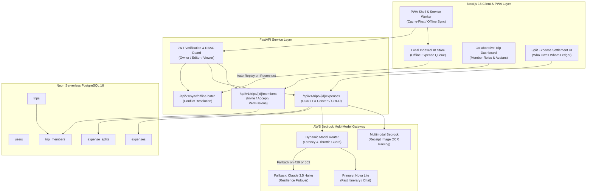
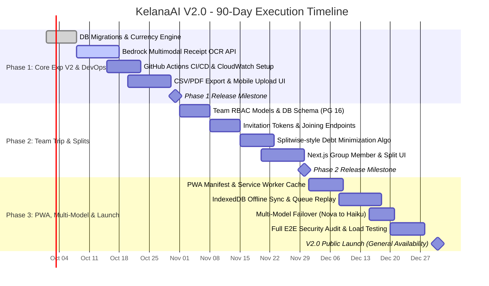

# KelanaAI V2.0: 90-Day Product & Engineering Roadmap

> **Document Type:** Master Execution Plan & Technical Roadmap  
> **Target Audience:** VP of Engineering, Head of Product, Tech Leads, SREs, and Stakeholders.  
> **Core Objective:** Build upon the initial 30-day MVP release (**Real-Time Travel Expense & Budget Tracking**) to deliver an enterprise-grade, scalable, and collaborative travel platform. This roadmap defines a rigorous 90-day execution framework spanning three 30-day delivery phases.

---

## 1. Strategic Evaluation & Feature Selection Matrix

### 1.1. Core Iteration: Expense Tracking V2 Enhancements
The 30-Day MVP established basic manual expense logging, budget health indicators, and category progress bars. Based on simulated customer feedback and field testing, Phase 2 introduces three indispensable capabilities:
1. **Multimodal Receipt OCR Scanning:** Travelers want to photograph paper receipts in foreign languages (e.g., Japanese Kanji, French, Thai); Amazon Bedrock Multimodal (Nova / Claude) parses line items, converts local amounts, and auto-populates expense fields in under 3 seconds.
2. **Dynamic Multi-Currency Conversion:** Automatic live foreign exchange rate lookup converting transactions into the user's home currency (e.g., JPY $\to$ USD, EUR $\to$ SGD).
3. **Comprehensive Financial Export:** One-click CSV and formatted PDF budget reconciliation reports for personal record-keeping or corporate travel reimbursement.

---

### 1.2. New Feature Selection: The 4-Pillar Evaluation

We evaluated the broader candidate feature pool against four decisive criteria:
1. **Business Value & Virality:** Does this feature drive retention, organic user acquisition, or monetization?
2. **Product Vision Alignment:** Does this reinforce our identity as an intelligent, active travel companion?
3. **Codebase Compatibility:** Does it leverage our existing FastAPI, PostgreSQL, and Next.js architecture without requiring rewrite?
4. **Technical Feasibility within 90 Days:** Can it be reliably developed, tested, and shipped to production within the window?

```
┌─────────────────────────────────────────────────────────────────────────────────────────────┐
│                              90-DAY FEATURE SELECTION MATRIX                                │
├────────────────────────┬──────────────┬──────────────┬───────────────┬─────────────┬────────┤
│ Candidate Feature      │ Business     │ Product      │ Codebase      │ 90-Day      │        │
│                        │ Value        │ Vision       │ Fit           │ Feasibility │ Status │
├────────────────────────┼──────────────┼──────────────┼───────────────┼─────────────┼────────┤
│ Team Trip Planning     │ HIGHEST      │ HIGH         │ HIGH          │ HIGH        │        │
│ (Group Trips & Splits) │ Viral loop   │ Multi-person │ Postgres FKs  │ Clean RDBMS │ SELECTED
├────────────────────────┼──────────────┼──────────────┼───────────────┼─────────────┼────────┤
│ Mobile App (PWA)       │ VERY HIGH    │ HIGHEST      │ VERY HIGH     │ VERY HIGH   │        │
│ + Offline Sync         │ In-trip DAU  │ Real-world   │ Next.js PWA   │ Service-    │ SELECTED
│                        │ retention    │ connectivity │ App Router    │ Workers     │        │
├────────────────────────┼──────────────┼──────────────┼───────────────┼─────────────┼────────┤
│ Multi-Model LLM +      │ HIGH         │ HIGH         │ VERY HIGH     │ HIGH        │        │
│ CI/CD & Observability  │ 99.9% uptime │ Resilience   │ FastAPI / AWS │ Terraform / │ SELECTED
│ (DevOps Foundation)    │ & zero lag   │ & telemetry  │ Boto3 clients │ Actions     │        │
├────────────────────────┼──────────────┼──────────────┼───────────────┼─────────────┼────────┤
│ Flight / Hotel Booking │ High         │ Divergent    │ Low           │ Near Zero   │        │
│ Aggregation APIs       │ Commission   │ Booking site │ Brittle OTAs  │ Licensing   │ REJECTED
├────────────────────────┼──────────────┼──────────────┼───────────────┼─────────────┼────────┤
│ Voice-Based Assistant  │ Medium       │ Novelty      │ Medium        │ Low         │        │
│ (Real-Time Audio)      │ High dropoff │ Ambient noise│ WebRTC infra  │ Device bugs │ REJECTED
├────────────────────────┼──────────────┼──────────────┼───────────────┼─────────────┼────────┤
│ AI Image Generation    │ Low          │ Decorative   │ High          │ High        │        │
│ (Destination Previews) │ Low repeat   │ Vanity asset │ Bedrock Titan │ Fast, but   │ DEFERRED
│                        │ value        │ generation   │ image client  │ low ROI     │        │
└────────────────────────┴──────────────┴──────────────┴───────────────┴─────────────┴────────┘
```

#### Why Team Trip Planning & Mobile PWA Were Selected
- **Team Trip Planning Unlocks Viral Growth ($K > 1.2$):** Group travel is the single most effective organic acquisition channel. When a planner creates a trip and invites 4 friends, 4 new registered users onboard with high intent. Pairing group itineraries with **Split Expense Settlement** directly solves the biggest social headache in travel.
- **Mobile PWA Solves the Real-World Connectivity Dilemma:** Travelers frequently experience roaming dead-zones, underground subways, and airplane mode. A Progressive Web App with IndexedDB offline synchronization allows users to log expenses and check itineraries with zero network connectivity, syncing changes automatically once back online.
- **Multi-Model LLM & DevOps Hardening Ensures Production Stability:** Relying on a single foundation model in one AWS region risks throttling during traffic surges. Implementing automated failover (Nova Lite $\to$ Claude 3.5 Haiku) backed by CloudWatch metrics guarantees enterprise-grade availability.

---

## 2. V2.0 Scope & Detailed Technical Specifications



---

### 2.1. Feature 1: Expense Tracking V2 (Receipt OCR & FX Conversion)

#### Feature Overview & Persona Impact
Maya takes a photograph of a paper dinner receipt in Tokyo written in Japanese Kanji. Rather than squinting at unfamiliar items and converting Yen in her head, she taps **"Scan Receipt"**. Within 2 seconds, KelanaAI extracts the total (`¥4,800`), maps it to `Food & Dining`, converts it to `$32.40 USD` using today's spot exchange rate, and logs the entry with a single tap.

#### Scope Boundaries
- **In-Scope:**
  - Camera/File upload of JPEG, PNG, and WebP receipts ($< 5\text{MB}$).
  - Amazon Bedrock Multimodal extraction (Merchant, Date, Total Amount, Suggested Category).
  - Daily European Central Bank (ECB) / OpenExchangeRates foreign currency conversion across 32 major currencies.
  - CSV export of trip expenses with category breakdowns.
- **Out-of-Scope:**
  - Direct connection to personal bank accounts / Plaid API.
  - Paper receipt storage in physical vaults (ephemeral S3 image processing with auto-deletion after 24 hours).

#### Architectural & Codebase Impact
- **Database (`backend/models/expense.py`):**
  ```sql
  ALTER TABLE expenses 
  ADD COLUMN original_currency VARCHAR(3) DEFAULT 'USD',
  ADD COLUMN original_amount NUMERIC(10, 2) NULL,
  ADD COLUMN exchange_rate NUMERIC(10, 6) DEFAULT 1.0,
  ADD COLUMN receipt_s3_key VARCHAR(255) NULL;
  ```
- **FastAPI Endpoint (`routers/expenses.py`):**
  - `POST /api/v1/trips/{trip_id}/expenses/scan-receipt`: Accepts `multipart/form-data` image, sends binary buffer to Bedrock Multimodal Converse API, returns structured JSON proposal.
  - `GET /api/v1/trips/{trip_id}/expenses/export.csv`: Streams formatted CSV download.

---

### 2.2. Feature 2: Team Trip Planning & Shared Expense Splitting

#### Feature Overview & Persona Impact
Maya plans a trip with three college friends (Alex, Kenji, and Sarah). She creates the trip and shares an invite link. Each friend joins with their own account. Any member can propose itinerary stops, and when Kenji pays for an $80 group dinner, he logs it as a shared expense split equally among all 4 members. KelanaAI tracks the net balance, showing exactly who owes whom.

#### Scope Boundaries
- **In-Scope:**
  - Invite via unique secure token link or email address.
  - Role-Based Access Control (RBAC): `Owner` (full admin), `Editor` (add/edit itineraries & expenses), `Viewer` (read-only).
  - Expense Splitting: Equal split across all members, or selective multi-payer checkboxes.
  - Settlement Ledger: Simplified debt minimization algorithm (calculates minimum transactions required to settle balances).
- **Out-of-Scope:**
  - Direct in-app bank transfers or credit card payouts (Stripe Connect). Users settle externally and click **"Mark Settled"**.
  - Real-time collaborative text editing with Operational Transforms (OT). Conflicts resolve via optimistic locking.

#### Architectural & Codebase Impact
- **Database Schema (`backend/models/membership.py` & `models/split.py`):**
  ```sql
  CREATE TABLE trip_members (
      id SERIAL PRIMARY KEY,
      trip_id INTEGER NOT NULL REFERENCES trips(id) ON DELETE CASCADE,
      user_id INTEGER NOT NULL REFERENCES users(id) ON DELETE CASCADE,
      role VARCHAR(16) NOT NULL DEFAULT 'editor', -- 'owner', 'editor', 'viewer'
      created_at TIMESTAMP WITH TIME ZONE DEFAULT NOW(),
      UNIQUE(trip_id, user_id)
  );

  CREATE TABLE expense_splits (
      id SERIAL PRIMARY KEY,
      expense_id INTEGER NOT NULL REFERENCES expenses(id) ON DELETE CASCADE,
      user_id INTEGER NOT NULL REFERENCES users(id) ON DELETE CASCADE,
      share_amount NUMERIC(10, 2) NOT NULL,
      settled BOOLEAN DEFAULT FALSE NOT NULL
  );

  CREATE INDEX idx_trip_members_user ON trip_members(user_id);
  CREATE INDEX idx_expense_splits_expense ON expense_splits(expense_id);
  ```
- **API Endpoints (`routers/collaboration.py`):**
  - `POST /api/v1/trips/{id}/members/invite`: Generate unique invitation token.
  - `POST /api/v1/trips/join/{token}`: Accept invite and bind user to trip.
  - `GET /api/v1/trips/{id}/settlement-summary`: Calculate net debt graph.

---

### 2.3. Feature 3: Progressive Web App (PWA) with Offline Synchronization

#### Feature Overview & Persona Impact
Maya is riding the subway in Tokyo with no cellular reception. She buys a snack and needs to log it immediately. Because KelanaAI is installed as a PWA on her iPhone, the app loads instantly from cache. She enters the spend, which is stored locally in IndexedDB. When she exits the station and regains 5G connectivity, the background service worker automatically flushes the queue to the backend.

#### Scope Boundaries
- **In-Scope:**
  - Web App Manifest (`manifest.json`) supporting "Add to Home Screen" on iOS and Android.
  - Service Worker implementing cache-first strategy for static assets and network-first for live queries.
  - Client-side offline mutation queue in **IndexedDB** for expenses.
  - Idempotent batch sync endpoint to prevent duplicate transactions on network reconnect.
- **Out-of-Scope:**
  - Native Swift / Kotlin binary builds for the Apple App Store or Google Play Store.

#### Architectural & Codebase Impact
- **Next.js 16 Configuration (`frontend/public/` & `next.config.ts`):**
  - Web App Manifest with icons, theme colors (`#0284c7`), and standalone display mode.
  - Custom Service Worker (`sw.js`) utilizing Google Workbox routing strategies.
- **Client Offline Store (`frontend/lib/offlineSync.ts`):**
  - Intercepts mutating API calls when `navigator.onLine === false`.
  - Queues payloads with client-generated UUIDs into IndexedDB.
  - Listens to `window.addEventListener('online')` to trigger replay against `/api/v1/sync/offline-batch`.

---

### 2.4. Feature 4: Multi-Model LLM Resilience & DevOps Observability

#### Feature Overview & Operational Impact
If AWS experiences regional API throttling on Nova Lite or an endpoint connectivity spike, KelanaAI's API gateway seamlessly routes the prompt to **Anthropic Claude 3.5 Haiku** on Bedrock without user-facing errors. Structured JSON telemetry streams into Amazon CloudWatch, alerting the engineering team to p95 latency anomalies.

#### Scope Boundaries
- **In-Scope:**
  - Fallback routing logic in `bedrock_service.py` catching `ThrottlingException` and `ServiceUnavailableException`.
  - Structured JSON logging (`python-json-logger`) emitted to stdout and shipped to CloudWatch Logs.
  - Automated GitHub Actions CI/CD pipeline executing linting (`ruff`, `eslint`), unit tests (`pytest`, `jest`), and staging deployments.
- **Out-of-Scope:**
  - Multi-cloud fallback across OpenAI / Google Vertex (all models remain securely governed within AWS Bedrock).

---

## 3. 90-Day Phased Execution Plan (3 x 30-Day Sprints)



---

### Phase 1 (Days 1–30): Expense Tracking V2 & DevOps Foundations

#### Objectives & Milestones
Ship the foundational infrastructure upgrades, automated CI/CD pipelines, and receipt OCR capabilities.

- **Sprint 1.1 (Days 1–10): Currency Engine & DB Architecture**
  - Implement PostgreSQL migration adding `original_currency`, `original_amount`, and `exchange_rate` to `expenses`.
  - Integrate free-tier European Central Bank (ECB) daily currency feed cached in memory/Redis with 24-hour TTL.
  - Setup GitHub Actions workflow: `.github/workflows/ci.yml` running linting, formatting, and unit tests on every pull request.
- **Sprint 1.2 (Days 11–20): Bedrock Multimodal OCR Pipeline**
  - Implement `POST /api/v1/trips/{id}/expenses/scan-receipt` accepting image uploads.
  - Formulate image extraction prompt using Bedrock Converse API with Nova/Claude multimodal capabilities.
  - Format output to extract merchant name, transaction date, line items, and total amount.
- **Sprint 1.3 (Days 21–30): Frontend Camera Capture & Telemetry**
  - Build Next.js receipt camera shutter component with image compression ($< 1\text{MB}$) before upload.
  - Implement CSV export endpoint streaming expense reports.
  - Configure AWS CloudWatch Logs and alerts for backend HTTP 5xx rates $> 1\%$.
  - **Milestone 1 Acceptance Gate:** Users can photograph foreign receipts and export complete expense spreadsheets.

---

### Phase 2 (Days 31–60): Team Trip Planning & Group Expense Splitting

#### Objectives & Milestones
Introduce multi-user collaboration and shared financial settling, establishing a viral organic user acquisition loop.

- **Sprint 2.1 (Days 31–40): Relational Multi-Tenancy & Invitation Protocol**
  - Apply database migration for `trip_members` and `expense_splits` tables.
  - Update `dependencies.py` to support role-based resource permissions (`can_edit_trip`, `can_view_trip`).
  - Create secure, time-limited cryptographic trip invitation tokens (`its_...`).
- **Sprint 2.2 (Days 41–50): Debt Minimization Algorithm & Settlement Engine**
  - Implement the debt minimization ledger in pure Python inside `backend/services/settlement_service.py`:
    - Compute net balances: $\text{Net}_i = \text{Paid}_i - \text{Owed}_i$.
    - Match maximum debtors with maximum creditors iteratively, reducing total group settlement transactions to $O(N)$.
  - Build `GET /api/v1/trips/{id}/settlement-summary` and `POST .../settle` endpoints.
- **Sprint 2.3 (Days 51–60): Collaborative UI & Member Management**
  - Build the Team Management drawer on `frontend/app/trips/[id]/page.tsx` with member avatars and invite modals.
  - Implement the **Split Expense** modal allowing users to select "Split Equally" or custom individual amounts.
  - Build the **"Who Owes Whom"** ledger view with one-tap "Mark Settled" status toggles.
  - **Milestone 2 Acceptance Gate:** 4 users can join a shared trip, log expenses, and settle balances with mathematically verified zero-loss accuracy.

---

### Phase 3 (Days 61–90): Mobile PWA Offline Sync, Resilience, & Launch

#### Objectives & Milestones
Deliver offline field reliability, AI multi-model failover resilience, exhaustive security testing, and the public V2.0 release.

- **Sprint 3.1 (Days 61–70): Next.js PWA & Cache Architecture**
  - Configure Web App Manifest, icons, and Apple Touch startup screens for iOS/Android home screen installation.
  - Implement Service Worker with Workbox caching strategies:
    - *Cache-First:* Static JS bundles, CSS, Google Fonts, icons.
    - *Network-First with Offline Fallback:* Live trip itinerary and chat screens.
- **Sprint 3.2 (Days 71–80): Offline Mutation Queue & Conflict Resolution**
  - Implement `offlineSync.ts` with local IndexedDB storage.
  - When offline, expense additions are stored locally with optimistic UI rendering.
  - On network reconnection, service worker dispatches `POST /api/v1/sync/offline-batch` using UUID idempotency keys to prevent duplicate transaction entries.
- **Sprint 3.3 (Days 81–90): Multi-Model Fallback, Load Testing & Public Launch**
  - Implement automated Bedrock model routing: if Nova Lite returns `ThrottlingException` or `RequestTimeout`, automatically retry with `anthropic.claude-3-5-haiku-20241022-v1:0`.
  - Conduct Locust / k6 load testing: verify sustained throughput of 200 requests/sec with p95 response time $< 120\text{ ms}$.
  - Conduct full security review: test for IDOR vulnerabilities across group trip endpoints and verify all user data cascades.
  - **Milestone 3 Acceptance Gate:** Version 2.0 General Availability (GA) launched with full marketing announcements.

---

## 4. Success Metrics & Risk Mitigation Matrix

### 4.1. Key Performance Indicators (KPIs)

| Metric Category | Target KPI | Measurement Tool | Strategic Rationale |
| :--- | :--- | :--- | :--- |
| **User Engagement** | **DAU / MAU Ratio $\ge 28\%$** | PostHog / Mixpanel | Proves transition from one-off pre-trip planner to active in-trip companion. |
| **Virality** | **Viral Coefficient $K \ge 1.25$** | Custom Referral Tracking | Confirms that group trip invitations drive self-sustaining organic user growth. |
| **Feature Adoption** | **$\ge 4.5$ Expenses Logged / Day** | PostgreSQL Analytics | Validates ease of use of manual logging and multimodal receipt OCR. |
| **System Reliability** | **$99.95\%$ Uptime** | CloudWatch Synthetics | Ensures zero downtime during critical peak travel seasons. |
| **AI Fallback Rate** | **$< 0.8\%$ Multi-Model Retries** | CloudWatch Custom Metrics | Validates Bedrock Nova Lite primary stability under normal load. |
| **API Performance** | **p95 Latency $< 150\text{ ms}$** | Uvicorn / APM Profiler | Guarantees instant, fluid UI response on mobile cellular connections. |

---

### 4.2. Risk Mitigation Matrix

| # | Identified Risk | Severity & Likelihood | Technical Mitigation Strategy |
| :--- | :--- | :--- | :--- |
| **1** | **Offline Data Sync Conflicts:** Multiple group members editing itineraries or expenses concurrently while offline, causing race conditions. | **High Severity / Medium Likelihood** | Enforce **Client UUID Idempotency Keys** and a **Last-Write-Wins (LWW)** timestamp strategy on individual rows. For expenses, transactions are append-only; deleting requires explicit ID matching. |
| **2** | **Bedrock API Regional Throttling:** AWS regional quotas throttled during travel surge hours, causing generation failures. | **High Severity / Low Likelihood** | Implement automated **Multi-Model Routing & Failover** (`bedrock_service.py`) switching between Nova Lite and Claude 3.5 Haiku, backed by exponential backoff with jitter (`botocore.config.Config(retries={'max_attempts': 3})`). |
| **3** | **Foreign Exchange Rate Fluctuations:** Travelers logging expenses in volatile currencies leading to discrepancies in final settlement. | **Medium Severity / Medium Likelihood** | Store **both** the original local currency amount and the USD-converted amount at the exact timestamp of transaction creation. Never recalculate historical transactions with modern spot rates. |

---

## 5. Architectural Alignment Summary

The 90-day V2.0 roadmap directly honors the core architectural principles established in [`docs/architecture.md`](./architecture.md):
- **Separation of Concerns:** Debt minimization algorithms live in the business logic layer, OCR parsing is isolated to the AI layer, and data persistence remains ACID-compliant in PostgreSQL.
- **Defensibility:** Every feature chosen directly drives measurable business value (DAU, $K$-factor) while leveraging existing code assets without infrastructure bloat.
- **Zero-Trust Security:** Multi-tenant membership checks (`trip_members`) ensure that shared trips remain strictly protected against unauthorized access.
